# 腾讯自研数据库CynosDB计算存储分离架构的实现和优化
计算与存储分离架构，不仅在性能、扩展性和高可用方面有大幅提升，而且架构的解耦使得计算层和存储层都获得了很大的优化空间，接下来主要讲一下CynosDB架构的实现，以及在新架构上做了哪些方面的优化。

内容大致分为三部分，首先是架构总体介绍，其次是架构的实现和相关优化，第三是CynosDB未来的演进路线。

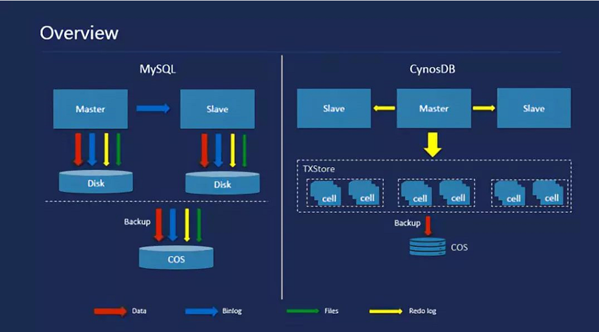

传统数据库的优化演进历史，基本上是和IO做斗争的历史，因为数据库是有状态、重IO的服务，左边是传统MySQL架构，可以看到其中有多个IO类型，主机需要将数据文件、日志文件、binlog文件等等保存在本地，再通过binlog的复制传给备机，备机仍然需要同样多IO，存储相同的文件，所以主机和备机的磁盘会有很多相同的IO和冗余的文件，而备份时仍然需要把这么多文件都备份出来，即便数据库被我们搬上云，在云上本地存储有可能变成云存储，但使用的空间依然没有减少，虽然我们在云上会有自动化运维等诸多的便利，但是为了在云上做弹性的扩容，我们依然面临传统数据库所面临的问题，如计算节点的扩容，需要从备份中恢复出完整一致的文件状态，那么TB级别的数据库可能需要一个小时甚至两三个小时，这其中大部分时间其实都花在了IO上。

基于以上痛点，传统厂商可能会选择共享存储替代本地存储的方案，虽然能解决部分问题，但基于网络的IO却面临着极大的挑战，往往需要昂贵的硬件和技术来支撑，无形中增加了数据库服务的成本。CynosDB则引入计算存储分离的架构，存储层使用共享的分布式块存储云服务，计算层则将不必要的IO全部卸载，实现计算与存储基于日志传输的新架构。

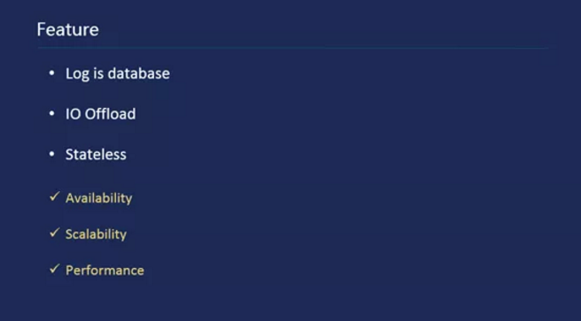

上图展示了CynosDB架构的几个特点，第一日志即数据库，架构中只有日志流，因而只有日志能表达数据库；第二是IO卸载，除了日志，其他所有类型IO全部卸载，如数据文件、源数据文件、biglog文件等；第三是无状态，本地文件将不复存在，包括日志文件，所以计算层是无状态的。基于这三个特点，我们能获得很大的收益，比如数据的高可用，其实大部分是来自底层高可用的分布式存储；其次是扩展性，如无状态备机计算节点的启动和故障切换是非常快的，可以在5-15秒之内完成；最后，架构卸载掉很多很重的模块和机制，使得总体性能上获得了很大的提升空间。
 
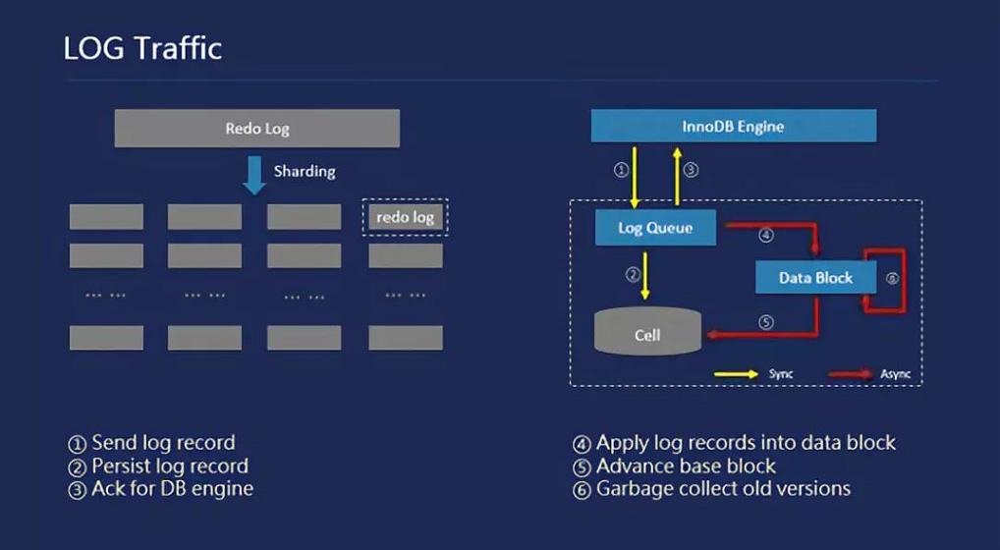

在新架构中，日志处理无可厚非是最重要，这里先简单介绍一下日志的处理流程。左边是一个日志的物理分布，连续的日志在存储层被打散成了很多的小的分片，分别存储在不同的cell里；而每个分片里日志的处理，从右边可以看到是一个日志处理的逻辑，首先存储引擎将日志发给存储节点，存储节点将日志放到一个日志队列里面，并将其持久化，之后立即返回给存储引擎，当存储引擎获得日志的反馈后就可以将一部分事务提交，以上这些步骤是同步的；存储节点会异步的进行一些操作，这些操作和事务的提交过程无关，不影响事务的提交响应速度，如异步日志的回放，当日志积攒到一定程度之后会进行一个页面版本的推进，此外还有历史页面和日志的回收等。

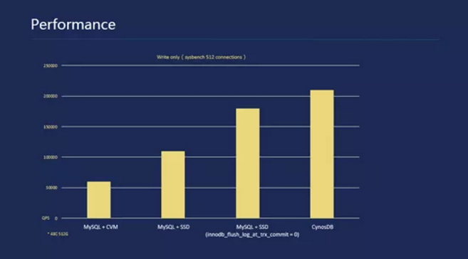

接下来是性能的一个预览，这里主要看一下写性能，最左边是云上自建的传统MySQL，受限于IO能力性能不是很理想；中间两个是部署在物理机上的MySQL，其中使用了nvme的ssd，当修改innodb_flush_log_at_trx_commit参数时，获得了两个差别比较大的性能表现，较高的一个是关闭了事务提交对日志刷盘的依赖，但性能的提升会导致可用性的降低，节点故障时未落盘的日志会导致数据的丢失；最右边的是CynosDB的性能表现，在未修改innodb_flush_log_at_trx_commit参数时，相较于云自建MySQL有了2.5倍的提升，甚至高于本地部署的最优表现。

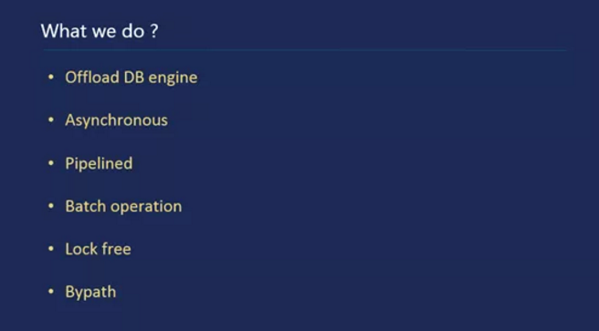

其实，将日志写盘由本地ssd转变为网络IO，响应时间后者肯定是不如前者的，虽然进行了很多相关的优化，但仍然略慢于本地存储，既然在关键路径上不如本地存储，但性能却能领先本地，那么CynosDB是如何达到这个目标的呢？这和CynosDB做的很多优化息息相关。第一，卸载了很多数据库引擎不再需要的模块和机制；第二是传统优化的三板斧，异步、流水线、批处理；第三，大量使用lock free结构；最后，引擎卸载之后，很多流程可以Bypath。

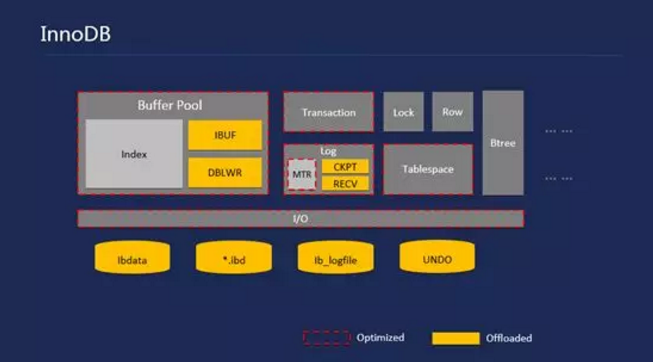

在介绍具体实现之前，先做一个计算引擎总体模块的回顾，大概了解一下InnoDB里涉及修改和优化的模块和机制。红色虚线的表示在CynosDB中进行优化的模块，黄色部分表示卸载掉的机制，如卸载了change buffer、double write、checkpoint、recovery以及本地文件等。

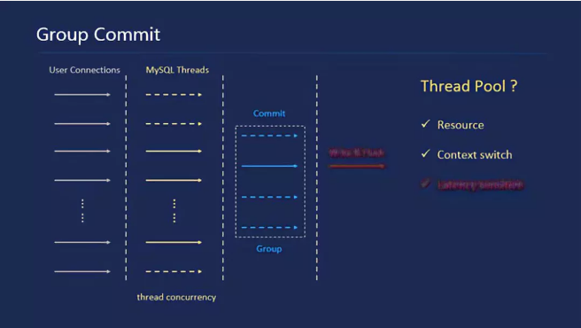

在数据库里面，如果buffer足够的话，数据库的写性能是和日志的落盘时间相关的，就是之前提到的参数默认为1的情况下，用户的大量连接对应相同数量的MySQL线程，当这些线程其中一部分提交事务时，其中只能有一个线程负责将日志从公有日志缓冲区写入日志文件，并执行文件刷盘，而其他线程需要等待这个线程刷盘成功，这是传统数据库组提交机制，那么这个机制可能存在几个问题，一是如果有大量的连接进来，MySQL将会为每一个连接创建一个线程，如果用户的业务没有连接管理，那么将会存在频繁的线程创建与销毁，浪费很多资源，同时，大量并发线程的锁冲突以及切换代价也会非常大，所以我们应对以上问题设想是否可以用线程池来进行优化，这也是最常用并且有效的方法。

CynosDB引入了线程池，很直接的解决了资源管理和线程切换的问题，但线程池只适合处理短任务，设想如果线程池里有一个时间线程有比较长的等待，等待一个IO或者日志持久化，这样的同步IO会使这个工作线程处于一个较长的等待状态，与此同时有很多用户连接在等待线程池的工作线程释放，所以线程池对任务延时特别敏感。

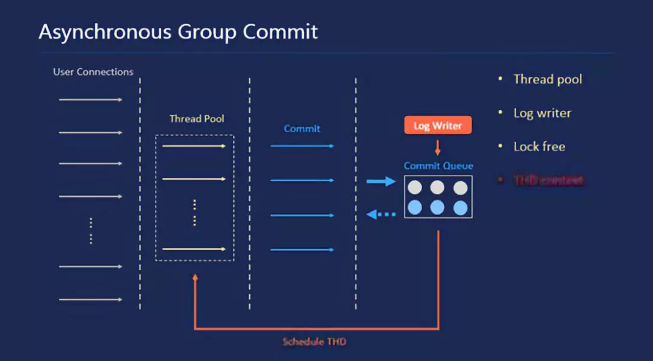

因此，CynosDB引入了异步组提交的机制，基于线程池实现，再增加独立的日志写线程log writer，每一个工作线程提交事务的时候，并不是去做写和刷的操作，而是将自己的请求提交到一个提交队列里去，然后立即返回给Server层，以便释放自己的线程资源；log writer线程会一直监控是否有新的日志产生，有的话就立即将其推送到存储节点；如果某一段日志持久化成功之后，log writer会唤醒提交队列里面等待的请求，将其重新调度到线程池的高优先级队列，重新获得工作线程执行事务提交后的工作。如此一来，我们就能高效的利用线程池的资源，同时做到资源的控制，避免上下文频繁切换带来的性能问题。异步组提交依赖于线程池，但最重要的一点是，我们将事务的一次执行拆成了两部分，实现过程中如何维护每一个线程的上下文环境会变得非常重要。

MySQL中每个更新事务会产生一次事务提交，而其修改可能涉及到很多物理页面，这些相关的操作会放到MTR里面去实现，目的是这些修改遵循一个原则，要么都修改，要么都不修改，即保证相关页面修改的原子性。一个事务会有多个独立的MTR产生，每个MTR在提交时需要加锁将自己产生的日志由私有缓冲写入到公有日志缓冲区，这里会涉及一把很重的锁，日志系统锁，MySQL 8.0用并行写入的方式优化了这把锁，但CynosDB的方式不太一样，既然我们的日志在存储上已经做了分片，那么相当于在计算层能天然地将其分区，而不用额外处理分区带来的问题，传统数据库会有不少日志分区的实现，但在恢复机制上都做了相应的改动，使得整个优化变得比较复杂，而CynosDB的恢复在存储分片上独立进行，整个优化在计算层实现，使得我们仅仅将锁进行分区即可。

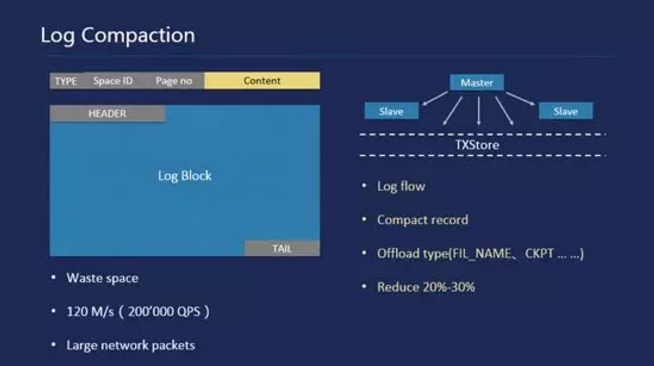

前面提到CynosDB的IO都是基于网络的，网络将承担所有的日志流，包括写往所有存储节点的日志以及传给所有备机的日志，而日志的分片处理使得我们不得不加入一些元数据处理日志，在高并发时将会产生大量的日志，网络带宽在极限情况下可能成为瓶颈，因此我们需要优化日志结构以减少不必要的空间浪费。

InnoDB中每个日志记录都会有一个日志类型，外加一个表空间的ID和页面的ID，最后才是真正的日志内容。前面一部分大概需要十几个字节，和传统磁盘处理一样日志有页面块的概念，从图中可以看到会有一个块头和块尾，大概占4%的存储空间，页面块上会有相关的元数据信息，如checkpoint、checksum等，这样其实浪费了很多空间。我们在二十万QPS的更新测试中发现每秒会有120MB的日志量，如果备机较多时通过网络传输这么多日志，即使万兆网可能也有些吃力，因此我们在CynosDB里面做了一些优化，首先CynosDB的日志传输是基于日志流的，那么原先的日志块的意义已经消失了，这样可以直接减少将近4%的空间；其次我们对日志记录也进行了压缩，但这个压缩几乎没有任何额外的代价，不会因为压缩而引起性能下降；最后，得益于新架构的特性，我们可以将一些日志类型卸载，如FIL_NAME、CHECKPOINT等。总体来说，经过以上的优化日志量减少了20%-30%。

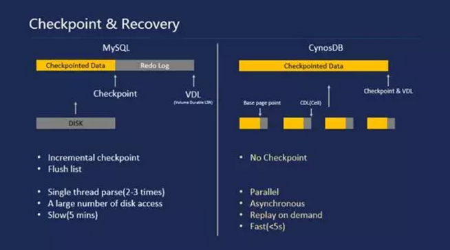

CynosDB与传统数据库在检查点和恢复上有很大的差别，传统数据库在崩溃之后，它需要找到崩溃前的一个一致性点来开始做恢复，这个一致性点就是我们说的检查点，所以系统会定期更新这个一致性点，通常日志会领先这个检查点，高并发时可能领先几百MB，甚至上GB。传统数据库在恢复前会找到检查点，从检查点开始读取日志，一直读到日志的VDL（最终持久化到的位置），然后开始恢复，因而恢复时间和这段日志的长度成正比。InnoDB的恢复，由一个线程负责解析日志，期间可能会解析两到三遍，这取决于日志长度，解析结束后，会有一些异步IO的线程来做恢复，但留给恢复使用的buffer pool却非常小，大部分内存空间被用于存储解析后的日志记录，这就导致了恢复一部分页面后因为buffer pool空间不足必须将这部分页面刷盘，才能恢复另外的数据页面，这个过程将始终存在直至恢复结束，因而会产生大量的重复读页面和刷页面的操作，导致整个恢复过程可能持续数分钟，甚至数十分钟之久。

另外，数据库系统都有检查点机制，有全量的，也有增量的，不管什么类型的检查点都需要相应的机制辅助，比如全量检查点需要将所有页面刷盘，增量检查点需要按照修改顺序维护的脏页链表，InnoDB的属于增量检查点，因而在InnoDB中会有一个名为flush list的脏页链表。

这方面CynosDB有一个很大的不同，其检查点和VDL实质上是一样的，对于计算层来说，只要把日志成功写下去，存储层就可以构造出相应的页面，那么检查点就是VDL。CynosDB日志分到不同的分片之后，在具体的分片上其实也有一个检查点，但这并不影响计算层检查点和VDL的关系，计算层实质上已经没有检查点的概念了，基于此，我们发现可以不需要再维护flush list，相当于卸载了一个很重的机制，同时恢复下沉到存储层，对每一个分片而言是相对独立且隔离的一段日志，它们之间可以并行的恢复。

CynosDB计算层的恢复将变得无比简单，仅仅需要获取一个VDL即可，存储层的恢复过程和计算层是并行且异步进行的，和传统架构中恢复必须先完成才能进行事务回滚不同，CynosDB在获得VDL之后即刻进行事务回滚，存储层异步回放建立在按需回放的基础上，即计算层需要哪些页面则优先恢复哪些页面，对于事务回滚来说回滚段页面可能是会被优先恢复的。有了以上几点优化，CynosDB整个恢复过程包括系统启动时间都非常短，基本达到5秒以内，实际中将取决于buffer pool的配置。

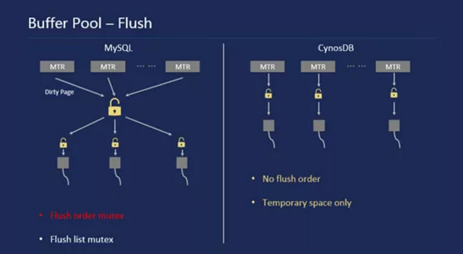

上面刚提到了增量检查点所依赖的相关机制flush list，为什么说它是很重的机制呢？因为我们需要维护一个全局的页面更新顺序，按照每个页面首次被修改的顺序将它们插入flush list，检查点会从链表尾扫描刷页面，然后记录检查点信息。既然需要维护全局顺序，那么就需要一把全局锁，即flush order mutex，传统MySQL中这把锁并不会表现的很热，因为必须持有日志系统锁才能申请这把锁，而热点大都集中在日志系统锁上，但CynosDB之前已经将日志系统锁通过分区消除了热点，那么热点就会顺理成章的转移到flush order mutex上来，幸运的是，CynosDB架构完美卸载了flush list，因而可以不用为这把锁而头疼。相应的，MySQL 8.0中优化完日志系统锁后改了检查点机制，目的就是为了优化掉flush order mutex，当然也增加系统的复杂性。

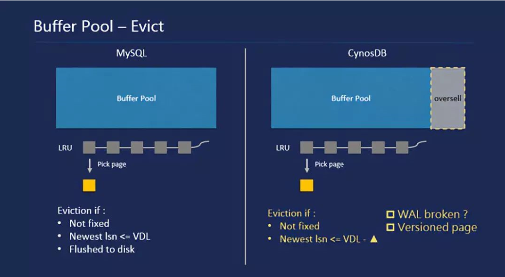

InnoDB的buffer pool中维护了几个链表，如之前提到的flush list，还有LRU list和free list，新的页面申请将从free list中获得空闲页面将其加入到LRU list，而当free list中没有空闲页时，数据库就会发生缺页问题，需要用户线程去做页面的淘汰。淘汰需要从LRU list中选择页面淘汰，需要满足几个条件，一是其引用计数为0，二是页面最新修改的LSN必须小于等于VDL，第三是页面需要刷盘，最终才能将页面淘汰，其中二、三条件都涉及同步的IO，所以缺页的时候常常会有性能的抖动。

CynosDB中可以消除页面刷盘，但依然需要满足其他条件，我们在CynosDB中把第二个条件做了一个扩展，即页面上最新的修改LSN可以小于等于（VDL-▲），这样可以尽快的将页面淘汰，避免等待新的VDL到达。当我们能很快淘汰一个页面时，对于固定大小的buffer pool，相对于以前，在遇到缺页时无形中扩展出来了一部分额外的空闲页面，相当于一个buffer pool的超卖，类似于用100G的内存实现了110G的buffer pool。这个▲值跟日志持久化的速度相关，太小没有效果，太大会有其他副作用。

这样的优化看似违反了WAL原则，即一个页面淘汰或者刷盘的前提是它涉及的日志先刷盘，但在CynosDB中页面的读操作是有版本的，传统架构中刷什么版本就只能读到什么版本，而CynosDB为了保证备机的一致性读，会提供读取历史版本的能力，同样也可以提供读取未来版本的能力，有了这个能力淘汰页面的优化也就不会违反WAL原则了。

传统的MySQL里，IO分为同步IO和异步IO，同步IO是每个线程自己读写页面，异步IO通常在恢复、预读、刷脏时使用，由特定的AIO线程负责读写页面。传统的异步IO有一些缺点，它的处理是顺序的，虽然有相邻页面的合并，但实质上IO还是串行的，因而整体吞吐量会比较差。

在CynosDB中，基于网络的IO通过新的RIO机制实现，同步IO和异步IO分别对应不同的IO队列，RIO线程将队列中的IO请求最快的推给存储节点，充分利用存储分片和其并行处理IO的能力，同样在RIO队列里会有相邻页面的合并，使用lock free的队列，整体IO性能会好很多。

传统的MySQL中，一个表扩展时，会进入悲观更新流程申请新的空间，第一步会做一个空间的预留，目的是不在更新的过程中去扩展空间，所以会在每一个操作刚开始的时候预扩展一部分空间，但InnoDB MTR有一个特点，放锁只能在MTR commit时发生，预留空间会导致必须持有space x lock，直到MTR结束，因而space x lock会有很长的一段临界区，这样的问题在并发灌数时会表现的比较明显。

在CynosDB中，同样的更新逻辑，因为没有本地文件，我们的扩展只依赖于存储层的扩展能力，而存储的扩展是完全异步的，对于计算层而言扩展仅剩下一点CPU操作，可以不需要提前预留扩展空间。为了进一步优化，我们又引入了一个细粒度锁segment latch，缓解space lock的压力，锁依然有，但把整个空间分配的临界区压缩到很短，因而空间扩展相对传统快了很多。

CynosDB卸载了所有本地文件，server层的元数据也包含在其中，现在元数据都基于日志传输，与MySQL8.0重新实现一整套数据字典的复杂玩法不同，我们为server层的元数据在InnoDB中扩展出一部分系统表，将其保存在其中。

最后简单讲一下CynosDB的物理复制，传统MySQL是基于binlog进行主备复制的，原因是它有很多不同的存储引擎，只能在逻辑层进行复制，而逻辑层面的复制往往比较低效。CynosDB的主节点将日志流发送给所有的备机，备机对日志进行批处理，每一批日志由多个并行的回放线程回放到对应的页面上；另外每一批日志对应一个readview版本，这里引入了一个readview cache，提升15%左右的读性能。

得益于物理复制的优势，主备事务时延能控制到毫秒级别，不像基于binlog的复制时延往往会比较高，而且受主机负载影响非常大。同时，CynosDB拉起一个备机只需要五到十秒，甚至可以更快，基于网络带宽的限制，目前最多可以支持15个备机。

目前为止，我们改了很多，也优化了很多，如何保证新架构中数据的正确性和一致性不受影响？毕竟有很多IO被卸载了，CynosDB提供多层次的数据校验机制，从用户可见的事务级别校验一直到物理日志和页面层面都有校验机制，从而保证数据的正确性和一致性。

