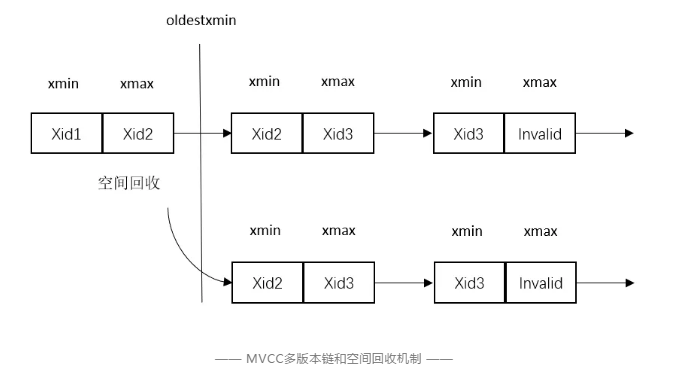

# TBase的架构体系和数据库事务的基本原理

腾讯TBase是一款腾讯自研高性能HTAP数据库，提供高性能的OLTP和OLAP能力，同时保证可扩展全局一致性分布式事务（ACID），为用户提供高一致性的分布式数据库服务和高性能的数据仓库服务。一方面解决了传统数据库扩展不足、数据sharding之后数据库事务的严格一致性难题、数据安全、跨地域容灾等问题，同时具备了高性能事务处理、数据治理、混合负载支持等能力。
在OLTP方面，TBase采用MVCC+全局时钟+2PC+SSI的方式来实现全局一致性分布式事务，同时引入大量性能优化的设计来减少全局事务带来的开销。在小规模集群上，TBase能够提供超过300万TPMTotal的事务处理吞吐量（工业界标准TPCC测试集）。

TBase是一款腾讯自研高性能HTAP分布式数据库，同时提供高性能的OLTP和OLAP能力，整体系统架构如上图所示。具体的，TBase由多个协调节点（Coordinator），多个数据节点（Data Node）和单个时钟服务器（GTS）组成。用户表数据采用shard机制 [9,12]在多个Data Node进行分布。Coordinator节点负载接受用户的SQL请求，解析SQL生成分布式执行计划，然后在Data Node上分配资源执行该分布式执行计划。每个Data Node运行着完整的数据库实例，包括存储层，日志层，事务处理层，查询优化器，执行器等。GTS负责生成严格递增的时间戳，用于保证全局一致性分布式事务。

数据库事务ACID是关系型数据库最基本和最核心的一个特性。数据库事务提供给用户一个强大的抽象概念，能够简化上层应用存储和访问数据的逻辑。比如数据库事务的最严格的Serailizable隔离级别可以保证并发的事务的执行效果和串行执行这些事务的效果是一样的，从而使得上层应用不需要考虑复杂的并发导致的一致性问题。数据库事务的原子性（A），一致性（C）和持久性（D）基本都是通过WAL（Write-ahead Log）日志来实现，在分布式场景下还需要引入额外的两阶段提交（2PC）来保证，这里就不详细阐述。本文重点介绍事务里面最复杂的隔离性（I）。

我们首先介绍一下 数据库隔离语义： read committed，repeatable read  和serializable。所有的隔离级别语义都需要满足：事务T1能够看到T2的修改，当前仅当T1.start > T2.commit。T1.start为T1事务开始的绝对时间，T2.commit为T2提交的时间。对于read committed，即T1.start为每条语句开始时间。

Read committed：满足上述的语义的同时，对于写写冲突，采取允许并行修改的策略，从而减少abort。具体的，对于一个tuple， T1(x, w)写入x值，T2(y, w)写入y值，如果T1先提交，则该值变为x，T2再提交时，将改成y。如果update语句中有where判断条件，T2会重新计算更新的最新值x是否满足条件，再进行更新。

Repeatable read: 对于写写冲突，采用First-commit-win机制，并行修改事务第一个提交的将成功，后面提交的将被abort。Repeatable read和read committed都会存在write skew的问题 [1,2]。考虑如下并发执行，T1执行读取x，然后将x值写入y，T2执行读取 y，然后将y值写入x。在Repeatable read隔离下，T1和T2均可以提交成功，但是执行结果不满足串行化执行T1和T2后的结果，即先执行T1再执行T2，或反过来。

Serializable：在Repeatble read隔离基础上，如果两个事务T1和T2存在读写依赖(rw-dependency），也会abort后提交的事务。Serializable隔离级别执行结果满足并行事务任意串行化执行的结果。即例如T1和T2并行执行，最后的结果满足任意串行化执行（T1->T2或者T2->T1）的结果。这种隔离级别执行结果最容易被用户理解，对使用数据库的应用程序来说，可以极大的简化上层业务逻辑（不用去考虑并行），但是会导致比较频繁的abort（在冲突比较大的时候）。

数据库实现上述隔离级别主要有三种主流的方法: 2PL,OCC和MVCC。
两阶段锁，是一种最简单又最低效的实现事务隔离的方法。2PL通过在事务开始阶段对所有访问数据对象进行加锁，在事务结束的时候进行解锁，来串行化并行事务的执行，从而实现Serializable隔离级别。该方法会导致极低的执行并发度。

OCC采用两阶段执行（execution phase和 commit phase）来提供事务隔离。
执行阶段：每个事务将writes缓存在本地write-set（对其它事务不可见），同时记录读操作到read-set（读的位置和序列号）。访问一个记录的时候，如果该记录被锁住（其它事务提交阶段锁），则选择abort。
提交阶段：该阶段将对write-set中的记录进行加锁，并检查读的记录（read-set一定包含write-set，因为修改一个记录需要先读一个记录，即read before write）在事务执行过程中是否被其它并发事务所修改（检查序列号），如果被修改，则abort本事务。如果没有被修改，则将write-set中的数据写入数据库存储，更新序列号，最后解锁。OCC可以提供Serializable隔离保证，但是读写冲突情况下，读并发低（很多负载是read-dominated的负载，改进读性能很重要）。

MVCC通过多版本来提供更高的读并发，同时通过snapshot isolation机制保证read-committed和read-repeatable隔离级别（相比serializable隔离级别弱）。MVCC的基本原理是通过多版本链来在并发写的情况下支持non-blocking读。MVCC可以保证并发更新的同时，并发读可以读到事务开始前（或者语句开始前）的一致性的数据库快照。

MVCC具体的实现方法是每个tuple（表的每个逻辑行对应的物理存储单元）都有一个xmin和xmax，xmin表示插入该tuple的事务xid，xmax表示删除该tuple的事务xid。Update操作由一个删除和插入组成。每个表的逻辑行由一串多版本的tuple链组成。每个事务开始前获取一个系统范围内正在运行的事务的xid集合（数据库快照），在访问某个逻辑行时，对它的版本tuple链进行遍历，从而找到对该事务可见的最新版本（即会拿xmin和xmax在快照中进行查找判断，读取事务开始之前已经提交的最新的tuple版本）。

快照判断的原理是，如果一个xid在快照中，说明插入这个tuple的事务在当前事务开始时正在运行中，则这个事务xid的修改对当前事务不可见。否则，当前事务进一步判断xid是否已经提交，如果已经提交（并且不在快照中），则该xid的修改对当前事务可见。
在一定的时候，空间回收进程对老的版本进行空间回收（热回收和冷回收），来释放空间，更重要的是减少版本链的长度（减少读搜索可见版本的开销）。热回收是在扫描的时候开启，用来将每个扫描的页面上的多版本进行compact从而减少搜索长度，来加速后面的扫描。冷回收是专门的进程运行，对表进行空间回收，即将页面上有效的tuple版本拷贝到新的页面上去，从而彻底回收空间。

空间回收有一个挑战是要判断哪些版本可以回收，从而避免回收掉正在（即将）被访问的记录。一个基本的算法（PostgreSQL里的算法）是计算整个系统范围内所有事务可见的最老的xid，然后回收xid < oldestxmin的事务插入后来被删除（或者更新）的记录。

Oldestxmin算法：在生成快照的时候，以系统范围内完成的最大的xid + 1为oldestxmin，然后更新oldestxmin小于或等于每个正在运行事务的xid，并且小于或等于每个事务生成快照时它计算出的oldestxmin。这样对于每个逻辑行，回收xmax < oldestxmin的tuple版本可以保证正在运行的事务一定可以看到对它可见的一个版本，即回收的版本不会被其它事务访问（不可见）。

上图展示了MVCC的基本原理。表的某个逻辑行有三个版本<xid1, xid2>，<xid2, xid3>和<xid3, invalid>，tuple的data部分被省略。Invalid表示是最后一个版本，每个删除或者更新会将invalid字段修改成该事务的xid，再插入一个新的版本（更新）。该逻辑行由xid1事务插入，并依次被事务xid2和xid3更新。假设有一个和xid3并行运行的读事务T1，则xid3在事务T1的快照中，T1进行扫描的时候，发现xid1和xid2均已经提交并且不在快照中，<xid1,xid2>对T1不可见，继续遍历下一个版本时，发现xid3在快照中，xid2不在并且已经提交，因此T1会读取该逻辑行的第二个版本<xid2, xid3>，从而在更新（xid3）的同时支持无阻塞的读（T1）。T1读取的是它开始时数据库的快照<xid2, xid3>。

同时，我们考虑空间回收机制，假设计算出来的oldesetxmin满足xid2 < oldestxmin < xid3，则空间回收进程会将该逻辑行的第一个版本进行回收，从而回收空间（冷回收）或者减少页面中版本链的长度（热回收）。

我们用反证法证明oldestxmin回收算法是正确的。

**证明**：回收事务为T1（xid2 < T1.oldestxmin <= xid3），假设被回收的版本<xid1, xid2>对当前正在运行的某个事务T2可见，则必须满足对T2来说xid1不在快照中，xid2在T2的快照中。由于xid2在T2的快照中，则必然满足xid2 >= T2.oldestxmin，从而T1.oldestxmin > xid2 >= T2.oldestxmin（不等式1）。由T1.oldestxmin > T2.oldestxmin可以导出T1生成oldestxmin发生在T2之后。由oldestxmin生成算法可知，T1一定会读取到T2的oldestxmin，并且将T1的oldestxmin更新为小于或等于T2的oldestxmin，即T1.oldestxmin <= T2.oldestxmin，这与不等式1矛盾。
因此，假设不成立。根据oldestxmin回收的版本<xid1, xid2>对当前正在运行的任意事务均不可见，运行事务会去读取下一个可见版本，即<xid2, xid3>或者<xid3, invalid>。
对于任意即将开启的事务T3,由于xid2 < T1.oldestxmin, 则xid2一定不会出现在T3的快照中，<xid1, xid2>这个被回收的版本对T3也不可见。证毕。

MVCC机制提供的snapshot isolation可以保证read committed和repeatable read两种隔离级别，但是没法保证Serailizable隔离级别。SSI技术是在MVCC的基于快照隔离机制上通过track并发事务之间的rw-dependency来提供Serializable隔离 [1,2]。实现方法主要是在事务中增加两个标识位（outConflict和inConflict）来标识该事务是否存在rw-dependency，同时增加新的锁机制（Postgres中的predicate lock）来检测读写依赖。

如上图所示（图来自[1]），读写冲突分为两种情况，一种是read-after-write，即T1写入或者更新了记录，T2在之后进行了读取操作，SSI会在读取的时候发现多版本中有对它不可见的新的版本，则会标记T1和T2之间的rw-dependency。一种是write-after-read，即T2先进行了读取操作，T1后进行更新，SSI利用SIREAD lock来检测。以PostgreSQL为例，SSI会对访问的tuple所在的relation，page和tuple进行加predicate lock。T1进行更新的时候，发现有predicate lock，则会去标记T1和T2之间的依赖关系。

主流分布式事务的设计与实现都是基于上述三种单机事务机制（2PL，OCC和MVCC）。
分布式OCC在执行阶段将写缓存在本地，并追踪读访问集合。在两阶段提交阶段，需要对所有对象进行加锁，然后进行验证读写冲突，最后进行解锁。在冲突比较多的情况下，事务处理的吞吐量会比较低。ROCOCO基于分布式OCC提出一种reorder的方法来减少分布式事务的冲突。MaaT采用动态时间戳技术来消除分布式OCC在两阶段提交阶段的加锁。

新的硬件特性（例如Intel的Restricted Transactional Memory和Remote Direct Memory Access）的出现提供了更加高效的分布式事务设计与实现选择。DrTM采用HTM和RDMA特性基于OCC实现了非常高效的分布式事务 [5-7]。DrTM核心想法是利用HTM来实现高效的本地事务，利用RDMA的强一致性的one-sided read语义协同OCC的版本和锁机制来实现高效的远程事务。HTM通过追踪CPU Cache的read-set和write-set来提供硬件事务语义（类似于OCC机制原理），即可以把一段要原子执行的代码封装在HTM接口中来执行。如果硬件事务T1访问的数据被其它事务T2并发的修改，则T1事务会被abort。RDMA的强一致性one-sided read语义在修改远端节点的CPU Cache Line的时候，会abort掉访问过该Cache Line的HTM硬件事务。利用上述硬件的特性，DrTM采用软件硬件协同设计的方法实现了分布式事务。例如DrTM将数据Cache Line对齐，并将锁和版本号等元数据放在第一个Cache Line头部，这样来利用RDMA的强一致性和HTM的Cache Track特性来实现高效的并发控制。

上图 展示了本地事务读写的伪代码逻辑。读的操作如果在本地写缓存中，则直接返回写值。如果不在，DrTM则会开启HTM事务去读取KV中的值，DrTM用HTM硬件事务来保护内部数据结构的并发访问（B树或Hash表）[7]。如果发现该记录被写事务锁住了，则会abort本事务（读取的记录被并发修改）。本地写则直接加入本地写缓存（修改由一个读操作加一个写操作组成）。

上图展示了事务利用RDMA远程读写的逻辑。远程读的时候，一条记录会有多条Cache Line组成，为了避免读到不一致的数据，DrTM采用在每条Cache Line头部加入序列号来检测一致性。通过不断重复度，一直读到一致性的完整的数据。

上图展示了提交阶段的逻辑。C.1进行加锁，利用RDMA的CAS原子操作进行。如果发现已经被锁住了，则abort（写写冲突）。C.2则是进行OCC里面的验证阶段，验证读操作集合里面的记录是否被同时修改了（读写冲突）。C.3和C.4则是利用HTM来执行本地读写的逻辑。C.5则是更新远程写，同时更新记录的序列号（用于其它事务检测读记录是否被修改），最后C.6解锁所有记录。

设计与实现基于MVCC的分布式事务的关键在于如何在多个节点读取同一个一致性的全局快照。一种方法是采用单机的快照机制，例如PGXL。分布式集群中有一个节点（例如GTM）维护一个全局范围内正在运行的事务ID列表。每个事务开始的时候从GTM获取一个当前正在运行的事务的快照，然后用这个快照去做tuple可见性判断。该方法存在两个问题：（1）开销很大，加锁生成快照的开销和网络传输快照的开销（快照大小等于当前并发事务数目）；（2）很难保证正确性，一个事务在提交的时候，首先在每个节点进行提交，从本地活跃事务列表中移除，然后再从GTM中移除，这样存在一个导致可见性判断错误的时间窗口。
另外一种方式是采用时钟的方式来保证，例如Google的Percolator [8]和Spanner [9]，以及MIT提出的Granola [14]。Percolator采用一个全局时钟生成器来生成递增的时钟，每个事务从这个timestamp server获取事务的开始时间戳和提交时间戳，从而进行数据记录可见性判断。具体的，如果T1.start_timestamp > T2.commit_timestamp，则T2的修改对T1可见。这样Percolator可以通过全局时钟来保证snapshot isolation。Percolator在底层的KV存储中为每个tuple存储多个timestamped版本，从而支持基于时钟的可见性判断。但这种全局时钟的方法仍然存在一个挑战，即并发事务申请的时间戳到达每个节点的顺序不一定一样，可能会存在一个事务在不同节点看到不一致的视图。

Percolator采用锁的机制来解决这个问题，具体的，Percolator的事务会在预提交阶段，在申请提交时间戳之前将它修改的对象加锁。如果在这个对象在被锁后，另外一个并发读事务在访问这个对象时，发现被加锁，则会等待锁结束再进行tuple可见性判断，即比较时间戳。这样可以保证，若T1.start > T2.commit，则T1可以在所有节点都看到T2.commit，从而一致性的看到T2的修改。

**正确性证明**：
物理世界事件发生的依赖关系是(TrueTime表示物理世界真实发生的精确时间):TrueTime(T1.lock)<TrueTime(T1.commit).
如果存在T2事务满足LogicalTime(T2.start)>
LogicalTime(T1.commit)，则T1申请commit发生在T2收到start之前，即 TrueTime(T2.start)>TrueTime(T1.commit)。
TrueTime(T2.start) >TrueTime(T1.lock) （传递性），则T2一定可以在所有节点都看到T1写入的锁记录，从而等待T1.commit到来。证毕。

Spanner [9] 采用物理真实时间（原子时钟和GPS时钟）来提供全球多数据中心的外部一致性（即分布式系统中很重要的特性Linearizability[11]）。Spanner给所有事务都提供真实的commit timestamp，并且返回给客户端。外部一致性的定义：如果T2.start > T1.commit，则T2.commit > T1.commit。即对外部客户端来说，如果T2开始请求发生在T1的提交之后，Spanner保证T2的提交时间戳s2一定晚于T1的提交时间戳s1。
Spanner通过TrueTime API来提供带有偏差bound的时钟，即[time-delta1, time+delta2]。为了避免时钟偏差带来的错误，Spanner的事务在提交阶段会加入Wait来等待真实时间已经过了分配给它的时钟，从而容忍机器之间的时钟偏差（ms级别的skew）。

**具体的时钟算法如下**: 
协调节点e1.commit（T1提交返回结果）和e2.start（开始T2事务）两个事件，并且TrueTime(e1.commit) < TrueTime(e2.start)。
则协调节点给T1分配提交时间戳为s1，同时等待超过它的时钟偏差再发起e1.commit，这样保证s1 < TrueTime(e1.commit)
同时TrueTime(e2.start)  <= s2，从而保证了s1 < s2。

Spanner采用2PL机制来保证内部Serializable隔离性。为了加速只读操作，Spanner为只读事务采用多版本免锁机制。

MILANA [10]利用IEEE PTP精确时钟同步协议，OCC和SDF(软件定义的Flash)多版本来实现Serailizable隔离。MILNAN的一个创新是利用Flash SSD本来就存在的多版本机制来实现数据库的多版本。MILANA事务也需要像Spanner一样等待一个时钟偏差来容忍不同机器之间的时钟skew。
我们设计的TBase分布式事务的目标是提供snapshot isolation隔离（支持read committed和repeatable read两种隔离级别）的同时，保证TPCC吞吐量可以随着节点规模增长而增长。

TBase采用全局时钟+MVCC多版本机制+2PC+SSI来达到上述目标。同时，TBase利用各个节点的SSI机制 [1-2] 来追踪rw-dependency来实现全局serializable隔离级别。2PC两阶段提交主要是用于保证事务原子性的。

对于TBase分布式事务设计最大的挑战是如何设计MVCC多版本回收机制。对于单机PostgreSQL的MVCC机制而言，事务xid分配是严格递增的，并且如果xid1 < xid2，则xid2在运行的时候，xid1必定已经在运行了。而对于基于全局时钟的MVCC，分配的时间戳到达每个节点可能是乱序的。

如上图所示，TBase的Coordinator从GTS服务器获取递增的GTS给事务分配开始时间戳和提交时间戳。但是并行事务在多个Data Node开启的物理时间和分配给它们的逻辑时间戳不一定一致（受网络和操作系统调度等因素的影响）。如何解决回收事务和正在运行的事务之间的冲突具有很大的挑战。

TBase分布式事务的主要的技术创新在于：
1.	多核可扩展的递增时钟生成服务器
2.	低开销的全局时钟一致性协议（相比Google Percolator的写锁等待机制开销更低）
3.	新的基于全局时钟的MVCC多版本回收机制（热回收和冷回收）

在实现了上述机制后，TBase可以在标准的TPCC测试集上达到线性可扩展和超过300万的TPMTotal的性能。数据库集群配置：30个数据节点和30个协调节点（TPCC客户端运行节点）。测试的隔离级别为read-committed级别。

上图表示的是TPCC吞吐量随着节点规模增长而增长，60节点时包含30个数据节点和30个协调节点（TPCC客户端执行节点）。

上图表示在30协调节点和30数据节点时，TPCC吞吐量随着TPCC的并发连接数上升而上升。
TBase后续将研究利用硬件特性来进行加速，例如利用RDMA来加速网络访问（包括GTS获取），设计新的数据中心有序硬件网络协议来更加高效的实现分布式事务等。

事务ACID是数据库的核心能力和特性，也是数据库区别去其它存储（例如KV）的一个重要区别。随着存储和处理数据量不断增长（PB级），数据库向着横向扩展的方向发展（分布式数据库）。在分布式场景下，如何提供分布式事务成为了一个非常重要和有挑战的问题。本文介绍了学术界和工业界在分布式事务设计与实现方面的例子以及他们的设计原理，然后阐述了我们的设计机制。TBase分布式事务在保证事务隔离（提供snapshot isolation，结合SSI可以提供serializable snapshot isolation）的同时提供了可扩展的OLTP性能，TPCC吞吐量可以随着节点规模或者并发数增长而增长，在小规模集群下可以超过300万TPMTotal。

