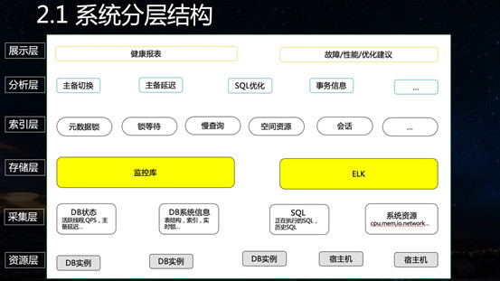
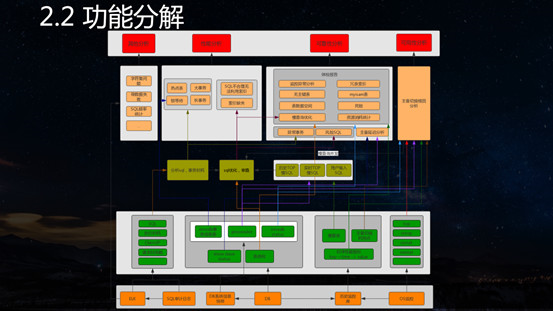
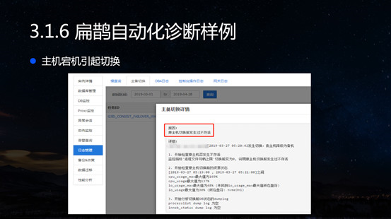
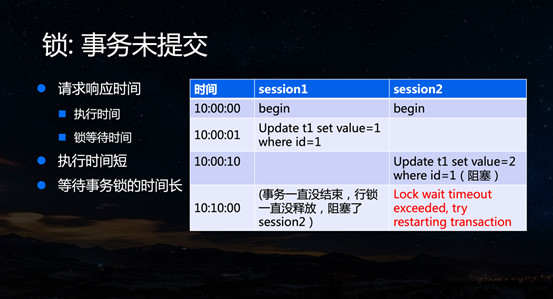
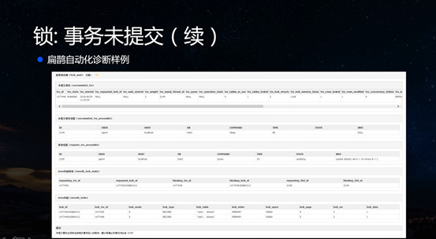
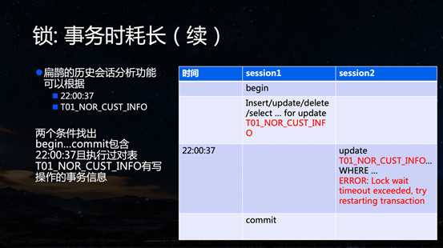

# 腾讯云扁鹊系统
扁鹊系统是TDSQL面向云市场推出的一款针对数据库性能/故障等问题的自动化分析并为用户提供优化/解决方案的产品。

TDSQL作为腾讯针对金融场景推出的高一致，分布式数据库集群的解决方案目前已覆盖了腾讯90%的支付业务场景，内部有大量团队使用；同时作为腾讯金融云的数据库产品，支持公有云和专有云两种云解决方案，目前拥有了大量的政府，银行、保险、物流、电商等客户，但随着客户和集群规模的不断扩大，在TDSQL运营过程中也带来了很大的挑战。

针对这些问题，我们认为需要一个自动化的故障/性能问题分析系统，减少DBA的重复劳动，沉淀我们的分析经验，快速定位问题，带给我们的客户最快速的响应同时也提升DBA的幸福指数。

之所以将这个模块命名为扁鹊，就是希望它能像古代的扁鹊神医为人诊断病因一样也可以为数据库“对症下药“，治疗/修复/预判数据库已知或潜在的风险。

在开发扁鹊系统的时候，随着DBA的专家知识库不断向扁鹊输入，目前我们大部分现网的性能/故障问题基本都可以通过我们扁鹊一键分析原因，大大解放了DBA的双手，极大提高了运营效率。下图是扁鹊在设计阶段所设定的基本功能和目标，核心点就是希望扁鹊能做到风险事前预警，事中准确分析原因并解决问题，事后能对历史事件进行分析，发现问题点。

扁鹊大体可以分为下图中的六个层次结构

1. 资源层主要包括DB实例和宿主机，提供各种原始的信息
2. 采集层会从资源层采集一些性能指标，SQL日志，表结构等必要的诊断信息并输送到存储层
3. 存储层负责将采集层提供的信息持久化，以供后续对历史数据进行分析
4. 索引层会从存储层提取数据再次进行分类并形成可编程的数据结构，也是分析层所需要的诊断单元
5. 分析层是扁鹊的核心逻辑，主要负责利用索引层的元数据信息结合TDSQL自身沉淀的知识库对数据库常见异常如主备切换，主备延迟，等问题进行根音分析，风险评估
6. 展示层最终会将分析层的结果可视化，大体可分为健康报表和具体的故障/性能/优化

建议

下图展示了扁鹊更细化的结构，可以看到扁鹊具备了哪些功能，这些功能需要哪些元数据，元数据又从哪些层面获取，各模块之间如何交互等，如果大家要做类似的功能可以基于这个做一个很好的参考。

**我们将客户经常咨询的DB问题大体分为三类，可用性问题、性能问题、可靠性问题。**

下面我们具体看一下扁鹊是怎样针对这三类问题进行分析并解决的。

## 1、可用性问题
可用性问题主要是指DB在一段时间内无法响应用户的请求

TDSQL作为金融级数据库本身是做了高可用的，当主机出现异常无法继续提供服务时会自动选则新主切换。这里我们探测主是否存活的方法是利用一个agent模块定期的连接DB并向TDSQL自建的一个心跳表中写入数据，这样无论是磁盘坏块，磁盘满了还是DB重启导致DB不可用，agent都能准确的判断出来，当agent连续一段时间写入心跳失败或超时就会触发切换的逻辑，在这期间DB会处于短暂的秒级不可用状态，从用户侧可能会收到DB只读，连接断开等异常。对于这种情况，业务往往需要清楚地知道切换的原因是什么，如何避免切换再次发生。

引起切换的原因有很多，这里我们列举了一些常见因素，如触发了内核某个bug导致DB重启hung住，磁盘故障导致DB无法写入。也有可能是由于用户的一些SQL过度的占用一些CPU、IO等资源导致的，如大事务，慢查询并发影响到用户或心跳线程写入等等。

要分析出切换问题的原因，我们首先要做的就是保留必要的现场信息，为我们后续的诊断提供线索。

这里我们实现了针对top，iotop，iostat等宿主机资源状态信息的秒级采集以及切换前DB内部processlist，innodbstatus等快照信息。我们上面列举的异常原因基本都可以在这些信息中反映出来，下面我们详细的解释一下如何利用这些信息分析切换原因，扁鹊针对这个问题的分析又达到了怎样的效果。

从自身的运维经验来看，由DB故障导致的切换并不常见，更多的情况是由于用户的SQL占用过多的系统资源引发的一些异常状况，主要可以分为慢查询并发和大事务两类，下面我们逐个分析两种行为触发切换的原因

TDSQL默认采用innodb存储引擎，在innodb中为了避免同时在innodb中同时运行的线程过多带来额外的性能开销，innodb提供了一个innodb_concurrency的参数，用于限制同时在innodb中执行的线程数的最大值，如果客户执行了用大量的并发连接执行慢查询，这些慢查询会不断地占用innodb的活跃线程，导致用户很多访问innodb相关的操作简单插入/更新等操作也容易被阻塞，等待innodb处理，同样也会引起agent心跳检测不断失败，从而触发主备切换。

当这种情况发生时，我们可以看到innodb status信息中有大量的线程处于等待队列，并且有很多慢查询在processlist中执行和很长时间，这样我们就可以分析事先保存的innodb status信息确认这一现象，再结合processlist中找出TOP 慢SQL就可以知道是哪些慢查询并发导致了这个问题。

TDSQL为了保证主备数据的一致性默认采用row格式的binlog，如果用户执行了一个delete大表的操作就可能产生一个非常大的binlog写入，由于binlog是顺序写入的，大事务的binlog没有完成写盘之前，后面一些小的写入操作如TDSQL心跳写入也会被阻塞在写入binlog的阶段等待大事务binlog写入完成，这个等待时间过程会导致心跳写入频繁出现超时。从而触发切换的逻辑，这种情况下我们会观察到innodb status中有大量事务已经完成的在innodb层的prepared，等待写入binlog，并且在processlist中有大量的心跳写入被阻塞。

目前针对这种情况TDSQL已经做了优化，比如默认限制binlog一次写入的大小不超过1.5G禁止大事务的产生。

结合上述分析流程，扁鹊会自动化的针对监控，切换前的DB快照等信息分析出切换的原因，并展示详细的分析过程。

1. 下图展示了扁鹊分析出由于DB发生不存活引发了主备切换

2. 这一例展示了扁鹊自动结合切换前innodb status的活跃线程已满和processlist慢查询过多两点判断出是由于慢查询并发触发了主备切换，并且扁鹊将processlist的SQL按照SQL指纹聚合起来，方便用户快速定位到是哪条SQL导致了这个问题
3. 这里我们看到扁鹊定位到了由于大事务引发的主备切换，并找到了引发大事务的具体SQL

## 2、性能问题
接下来我们介绍DB的性能，哪些原因会导致性能问题。

性能问题，从用户侧最直观的感受就是SQL的执行时耗过长，导致这个问题的常见原因有
* 网络因素，如延迟，丢包等
* SQL自身执行较慢
* 资源饱和
* 锁等待

网络问题我们暂不在此深究，这里我们主要针对后三种情况展开分析一下：

1. **SQL自身执行较慢**
对于SQL自身执行较慢通常是由于用户没有建立合适的索引，或者由于一些SQL写法上的原因导致没有利用到已有的索引，扁鹊针对这种SQL会自动的通过语法解析，SQL访问的表结构，数据分布等信息进行分析，生成合适的索引优化建议反馈给用户。

2. **资源饱和**
对于资源饱和引起的慢查询，如当前CPU/IO等资源飙升，扁鹊的会话分析功能会自动将当前会话按照SQL指纹进行聚合，从而快速找到导致消耗资源的TOP SQL再自动关联SQL优化模块得出优化建议，这样不论是普通用户还是DBA都可以快速定位到资源消耗的罪魁祸首同时对优化的方案一目了然。

3. **锁等待**
引起SQL请求时耗高的另一大常见因素是锁等待问题比如事务1中一个会话更新了一行，但是事务还没有提交，这时另一个事务2的某个SQL去更新同一行就需要等待事务1提交完成才能执行，这其中等待的时耗也会导致整个请求的时耗增加。这种情况下用户的可能会发现部分简单的操作例如主键更新正常情况下都是0ms的，偶尔突然变成了数十秒，当客户反馈给我们后，发现SQL执行时耗可能又正常了，下面我们看一下扁鹊如何辅助客户/DBA分析这类问题。

在下图的例子中我们可以看到session1 update t1某一行后一直没有提交，该行锁始终不释放，导致session2 update同一行的操作出现锁超时现象。

对于这种情况只要客户的session1不提交事务并且不与DB断开连接，这个会话持有的锁就会一直保持。MySQLinformation_schema下有三张表记录了事务之间的锁等待依赖关系，如下图中session4不被其他会话阻塞，但session4持有的锁阻塞了session1，2，3，这里我们称session4为持有锁的领头会话。这种情况由于锁等待现场环境还在，扁鹊就通过分析这三张表的信息可以找到持有锁的领头会话并建议用户kill session4来解除锁等待。

**下图是扁鹊诊断这种锁等待的效果图**

除了事务未提交以外，用户的业务逻辑也有可能在执行完事务中所有SQL后没有立即提交事务，导致事务持有锁时间较长。在下图中可以看到session1执行完update t1后隔了50s才提交事务，导致session2的update同一行操作的时耗也在50s以上甚至出现锁超时错误，如果用户在15点反馈12点某个时刻出现了这样的问题，我们再去查看information_schema下的锁信息内容会发现已经没有这样的锁等待关系了，针对这种情况，我们只能通过用户执行过的SQL日志，来找出session1这个历史会话信息，那么我们面临的问题是

1. 从哪里提取SQL日志？
2. 如何通过用户提供的慢查询高效的找出session1这个历史会话信息？

**从哪里提取SQL日志？**

TDSQL的在用户和DB的连接之间有一个proxy层，所有的用户SQL执行都会先经过proxy，在proxy中实现了高效的日志模块，可以将用户执行过的SQL，执行时耗，客户端地址等信息脱敏后全量的保存下来，并且对性能没有任何影响。

**如何通过用户提供的慢查询高效的找出session1这个历史会话信息？**

虽然有了用户全量的历史SQL信息，但是我们仍然难以直接从日志中找到session1在某一时刻阻塞session2这种时间序列“交错”的会话信息，或者说是session1事务开始结束时间覆盖了某个时间点的事务信息。

这里扁鹊实现了一个事务模拟器，可以通过按客户端执行记录的IP:PORT分组并结合语法解析回放用户执行过的SQL来提取所有事务信息，如事务的开始，结束时间，事务中访问了哪些表，事务的影响行数，事务的总时耗等等，这样我们就可以通过设定过滤条件以事务为单位来找出某个事务具体的执行信息。

**扁鹊诊断案例**

接下来我们来看一个案例，用户反馈在22:00:37这个时刻update T01_NOR_CUST_INFO这张表出现了锁超时。

扁鹊通过设定22:00:37，T01_NOR_CUST_INFO这两个条件就可以自动找出事务执行时间包含22:00:37并且对T01_NOR_CUST_INFO有过update/delete/insert/selectfor update等可能产生行锁的事务，并自动的提示用户这个事务时耗过长，持有的锁时间过长可能影响其他会话这一异常信息。有了这个功能，我们就可以根据用户提供的慢查询出现的时间点和SQL快速的找出影响的会话具体信息，用户就可以根据扁鹊提供的事务信息和时间来排查业务逻辑修复问题了。

## 3、可靠性问题
DB的可靠性问题主要表现为业务目前可能并未感觉数据库访问存在异常，但是想为DB做一次体检来确定DB是否有潜在的风险或隐患导致未来某一时刻DB出现异常的问题存在。

对于DB潜在风险的排查，我们针对性能监控，表结构，历史会话，慢查询等信息结合腾讯云海量数据+机器学习的能力系统的评估DB的健康状态，检测可能的异常并告知客户，尽可能将大部分异常在发生之前就发出预警，将风险降到最低。

以上我们介绍了由TDSQL运营痛点催生扁鹊的需求背景，以及扁鹊的层次结构，组成元素，还有主备切换，锁等待分析等关键技术的诊断原理，实践经验。拥有扁鹊后在公有云性能类咨询工单已经基本降为0，可以看出扁鹊目前的功能已经可以很好的服务于客户也提升了DBA同学的生活品质。

