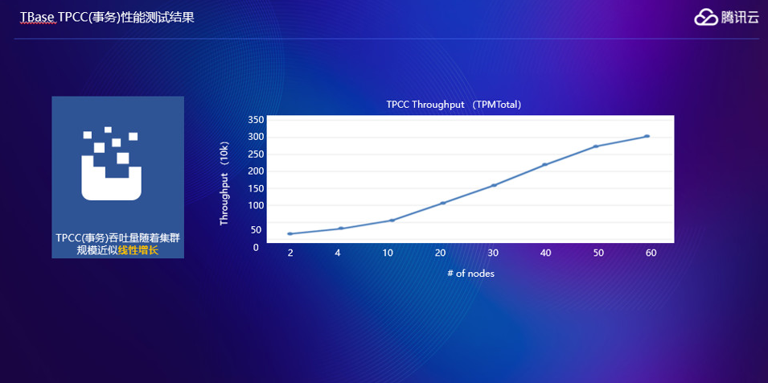
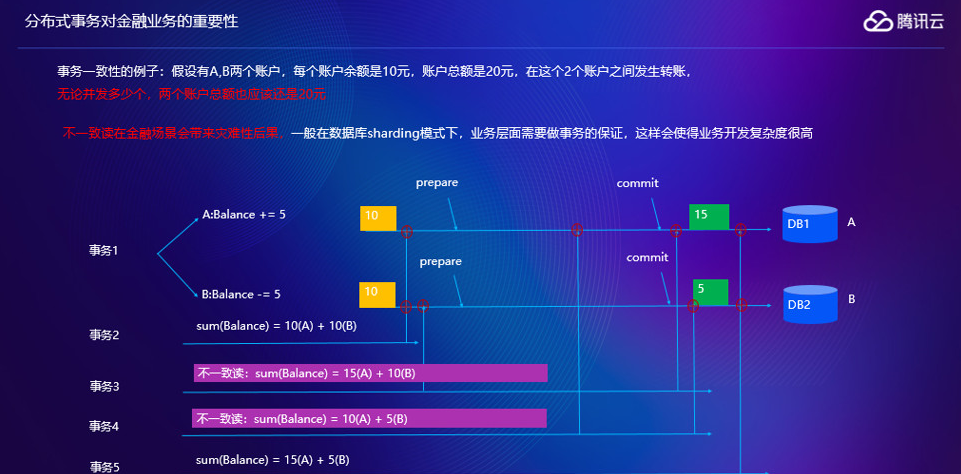
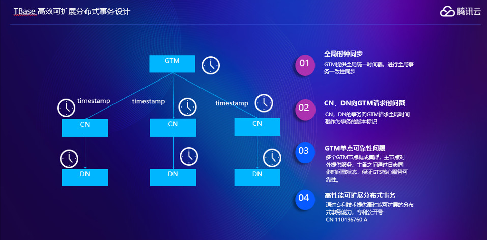
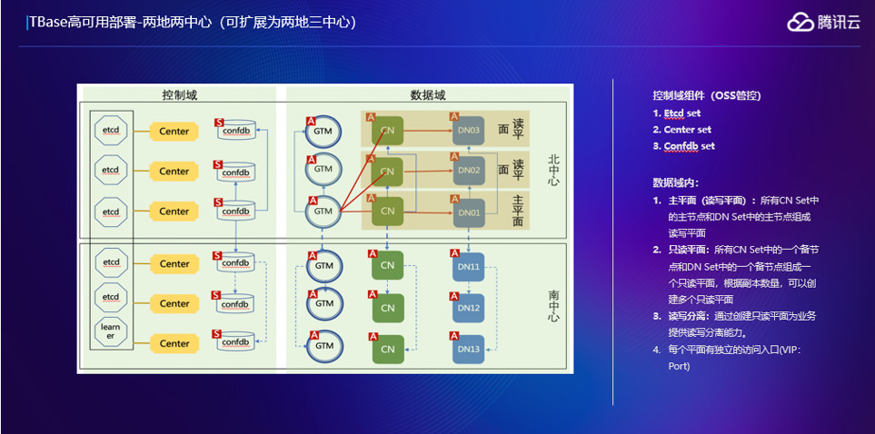
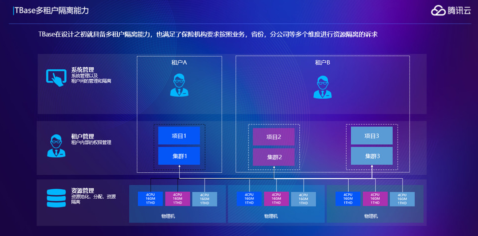
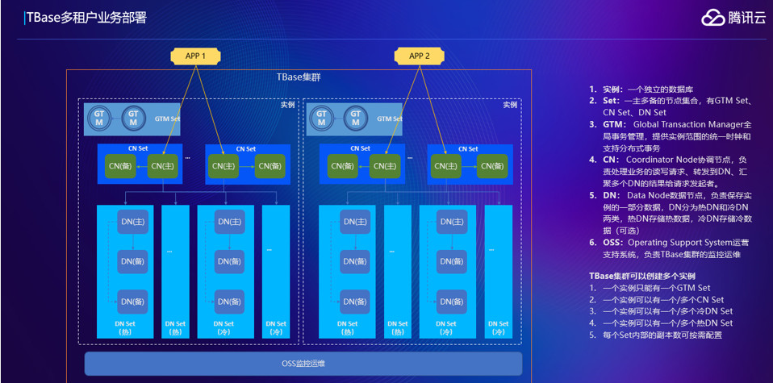
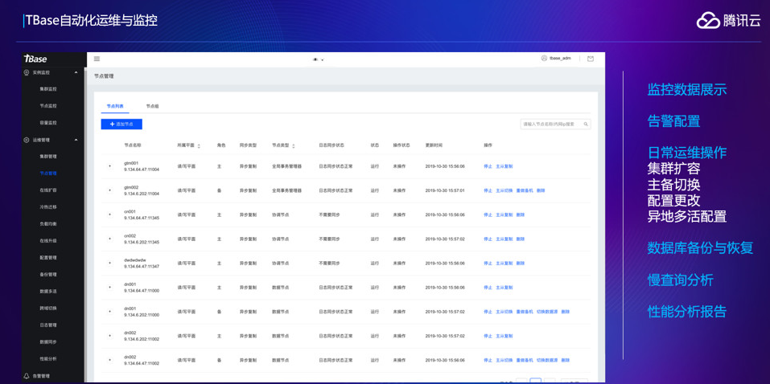

# 腾讯云数据库在金融行业的应用实践
实现信息技术的自主可控，可以说是金融行业最紧迫、最重要的推进战略了。人民银行、银保监会等主管部门密集出台文件，指导金融行业核心领域自主可控技术应用。

拿数据库来说，自主可控这事儿业内也没少探索。在腾讯云多项技术能力的支持下，微众银行就打造出国内首个基于分布式数据库的互联网银行分布式核心系统架构。该系统架构现已可支撑单日处理最大金融交易笔数达3.46亿笔。最近，腾讯云和张家港行 又联手搞了件大事。张家港行新一代核心系统采用腾讯云TDSQL来承载核心业务数据，这也是业界第一次在传统核心领域实现全面自主可控，标志着腾讯云TDSQL成为了首款应用于银行传统核心的国产分布式数据库。

下面一起来瞧瞧，拆解难事的具体过程：首先，为了干成这件大事，在正式部署之前，张家港行用一年多的时间进行大量的技术验证，并在中间业务平台等生产环境下也积累了丰富的测试数据。

在系统建设过程中，张家港行联合腾讯云及系统建设方长亮科技，充分结合银行传统业务与互联网业务的场景差异，对业务逻辑进行重新设计，共同完成新一代核心系统应用兼容性改造和数据库升级优化。

一般的改造到这里就行了，但对于银行来说，试错的成本是难以承担的，小心才能驶得万年船。为此，依托TDSQL提供异构数据库同步方案，三方还共同制定了TDSQL和集中式数据库数据准实时同步的策略，作为兜底方案。最终，在充分的技术验证和周密的实施方案保障下，张家港行搭建出一套具备高可用和强一致等特性的数据库架构。数据库采用分片“一主三备”的模式，保证主节点故障时可以在40秒以内自动切换到备节点并恢复业务；完善的全局分布式事务设计，也能够完全避免发生错帐、乱账、账不平等问题。系统的平稳投产受到了来自监管部门的认可。张家港行也成为了全国首家在传统核心系统中采用国产分布式数据库的商业银行。

当然，最初设计的双版本同步兜底方案，最终没有派上用场。

实现自主可控后，肉眼可见的好处不止一点：

1.**成本下降**

新核心系统在硬件层面全面采用x86服务器，取代传统商用数据库所需的大型机、小型机，成本优势明显。数据显示，张家港行采用腾讯云TDSQL分布式数据库架构后的硬件成本，只有传统架构成本的1/5甚至更低。

2.**性能提升**

* 基于腾讯云TDSQL的新核心系统表现优异：
* 高频账户类交易耗时在300毫秒之内
* 查询类交易耗时在100毫秒之内
* 20秒内可以完成1万笔批量代发代扣业务
* 日终跑批耗时14分钟
* 存款结息耗时11分钟
* 贷款结息耗时3分钟
* ……

批量业务进行时，数据库负载均保持在10%以下，完全满足张家港行未来五到十年业务发展需求。

腾讯云TDSQL还能发挥分布式数据库在线横向扩展的优势，当张家港行后续业务发展需要时，只需加入硬件资源，便能够自动水平扩展化解性能瓶颈。

3.**运维省力**

腾讯云提供的“赤兔”和“扁鹊”系统为数据库实现自动化运维提供了丰富的工具，极大地解决了困扰传统集中式数据库运维效率问题。

其中，“赤兔”平台能提供上百项监控指标的展示，结合灵活丰富的告警策略提供风险预警；“扁鹊”作为一套智能检测系统，能轻松应对锁冲突、索引缺失、故障切换等数据库异常，大幅缩短日常定位排查问题的时间。

同时腾讯云在保险行业也做出了优异成绩，在早期跟保险公司做交流的时候，客户有五个基本需求：
1. **高扩展性**。保险公司大家都知道比如寿险、车险、财产险，业务量都很大，随着业务规模的扩大，需要数据库为它的快速发展提供支撑。
2. **分布式事务**。数据一致性是金融行业的核心诉求。
3. **高可用性**。比较容易理解，要求7×24小时的服务保障，RTO秒级，RPO为0。
4. **多业务隔离**。因为保险公司是分业务的，业务又可能是分省的，每一个业务都有不同的集群，会带来比较大的成本支出，所以要求业务既能共享，又需要做隔离，这里我们是怎么做的，下面会详细介绍。
5. **易运维**。保险行业非常重视安全性，客户要求我们系统私有化部署，最终上线之后运维会交给客户，是否易运维是一个很大的考量点。

首先看一下高扩展性，大家看一下TBase的架构就明白了，红框是TBase的内核，内核分三类主要的节点，第一类是GTM的节点，这个节点保证分布式事务的一致性，第二类节点是协调节点，是用户访问的一个接口层，用户查询访问我们协调节点会翻译成查询计划，在数据节点做数据计算，把结果返回到协调节点，做汇总，再返回给应用。第三类就是数据节点，负责数据计算和存储。这里可以看到：如果你觉得当前的集群支撑不了业务，加一些机器过来就可以提升你的处理能力，集群的处理能力与TBase的规模呈准线性的增长。

这里我们做了一个测试，横坐标是机器的台数，纵坐标是吞吐量，可以看到是集群处理能力跟集群规模是准线性的增长关系。

再看一下分布式事务对金融业务的重要性。

举一个例子，转帐场景下，从B账户转5块钱给A账户，假如说用分库分表的模式考虑这个问题。有另外一个事务，是查询这两个账户的和，如果在前面两个转帐事务之前可以查到账户余额是10+10是20块钱，这个是没有问题的。如果有一个事务3，这里面会出现一个情况，首先在B转出账户提交之前，另外一个查询是在A转入的提交之后，到达节点时间的差异，这里面会出现一个问题，就是说两个的和会多出5块钱出来，就出现读不一致。

还有一种场景，假设我在第一个账户转入之前，在第二个账户转出之后，这里面会有一个问题，就会发现会少5块钱，分库分表的模式下读一致性不是能时刻保持的。假如说还有一个事务，在两个事务都提交之后再去读的话，就会发现两个账户和是OK的，是没有问题的。这说明一个问题，就是在分布分表的场景下不能保证任意时刻的读一致性，这在金融场景是很严重的后果。业务一般会在业务逻辑上来规避这个问题，这就导致业务开发复杂度会变高。

TBase做了一些事情来减轻业务开发的复杂度，引入一个全局时钟的节点，就是上面的GTM，提供全局统一时间戳，进行全局事务的一致性同步，通过TBase MVCC机制可以保证任意时间的一致性。

可靠性和性能是需要同时考虑的问题，可靠性我们采用GTM时间戳来保证可靠。扩展性上，因为GTM做的事情非常少，我们做过测试，在腾讯内部，一个256G内存64CPU的机器的GTM下，在集群规模比较大的场景下，可以跑到千万级别的TPS，这里有一个国际上的专利号，大家有兴趣可以查阅一下。

我们这个部署图是基于某保险公司，因为只有北中心跟南中心，所以我们是采用了两地两中心的部署，这个可以扩展成两地三中心的部署模式。

这张图显示的不仅仅是我们的数据域，也就是前面说的TBase内核模块，还有我们的控制域，就是我们的OSS管控系统，包括Etcd set， Center set和Confdb set，etcd set保证我们的管控系统都是可靠的。这里提一点，TBase集成了一个读写平面的特性，如果你对数据的实时性要求没那么高，可以通过我们的读平面进行数据读取，比如说数据的抽取，可能抽取出去，到其他系统做一些离线的计算。

这里面基于刚才说的部署模式，可以做一个故障场景的分析，还是分南北中心部署，通过VPC访问我们的服务，如果各个平面出现故障， TBase是怎样来保障服务的延续性。

首先来看最重要的读写平面的主CN故障之后会怎么做，假设说读写平面的主CN宕掉了，OSS会把同城的备CN升主，备CN升主会有一个问题，就是备平面不可用。我们的OSS系统会做一个事情，把读写层面的VIP映射到主CN，这样读写面和只读面会转向一个平面，会给主平面带来一些开销，但是保证了可靠性。
 
第二个场景是同城的备CN故障，会出现什么情况？这里备CN只会影响读请求但是不影响写请求，这里面只做一个操作，把只读VIP指向写VIP，这里面读写平面会承担之前只读平面的那部分压力，但是保证了只读业务不受影响。

假设主DN挂掉是什么情况，这里面也会把备DN做一个升主，如果备DN 升主之后，之前备平面不能用了，会把备DN所在平面的VIP做一个切换，转到读写上面去，就保证只读平面可以正常运行。

如果是跨城故障场景呢？假设说跨城的CN挂掉了，可以看到跨城的VIP其实指向两个CN，只需要做一件事情把这个VIP对应的故障CN删掉就可以了，不会影响只读，原来两个可以选一个，切换之后只是没得选。
 
TBase具备了多租户隔离能力，满足了保险机构要求按照业务、省份、分公司等多个维度进行资源隔离的诉求。

分为三个层级，从上至下是：系统管理层，通过租户来发起资源的申请，释放，或者是查看等；第二层是租户层，管理租户内部的权限；第三层是资源管理层，真正的将节点按照资源划分到服务器内。

在租户基础上，第二层对租户做权限分层，一个租户只有一个项目，只能看到这个项目，如果第二个租户有两个项目，可以看到这两个项目，但是第一个租户是看不到这两个项目的。租户管理这层，租户申请一些实例，最终会体现到物理资源里面去，这里面对物理资源可以简单说一下。我们对服务器的资源做了一个切分，比如说有一个比较强劲的物理机，比如说有100个核500多G的内存，一般的应用比如说一个测试库用不了这么大的一些资源，我们可以把这些资源做一些切分，通过租户对集群规模的申请，会智能的把这些资源分配到对应机器上去。最终会达到资源共享，可能租户1的实例的节点会分布到多台机器上，但是在多个实例之间又是相互隔离的。

上图是多租户在真实业务部署的案例，假设每个APP对应的就是其中一个服务实例，多租户这里面最重要的就是底下这层OSS管控系统，所有的实例，对TBase来说，是同一套管控系统管控的。一个管控系统可以管控多个实例，这样运维起来很方便。假设一个管控系统管理一个集群，这样运维人员处理的时候会非常的麻烦，管理多个集群可能要登录多个OSS。TBase这样一套OSS管理所有的实例，资源都是通过这一套管理系统做分配，也减轻了运维的工作。

通过TBase OSS管控系统，可以实现监控数据展示、告警配置以及告警记录查询、日常运维操作（集群扩容，主备切换，配置更改、多活配置等）、数据库备份与恢复、慢查询分析、性能巡检等一系列功能，极大的提升了运维效率以及问题定位的效率。

在自动化运维上，我们做了一个可视化的界面，主要是监控数据的展示、告警配置、扩缩容、数据库的备份恢复、慢查询、性能巡检报告，这个页面展示的我们节点分布的情况，还有可以查看运行状态、进行各种操作等。备份管理页面，TBase的备份目前是备到HDFS上，存量可以选几天备一次。数据恢复，涉及到多个结点怎么协调，恢复到什么时候才是一致的状态，因为每个节点的数据提交时间是不一样的，假设说所有的结点都恢复到十点，就可能会出现一个不一致的事务，TBase恢复系统会帮你智能选择一个一致的状态，提供给你一些可选择时间点；或者我们还提供另外一个选择，如果你了解这块的话，可以选择自己把时间的点算出来，这样会更精确。

