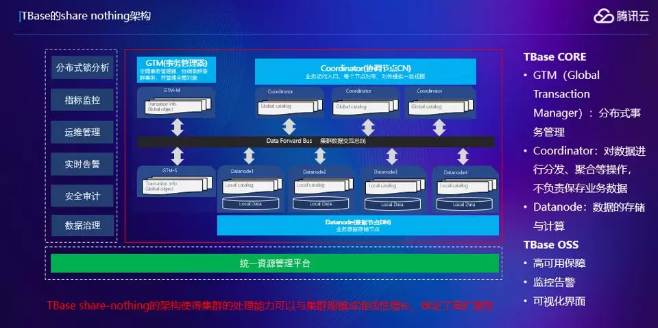

# 腾讯云数据库在金融行业的应用实践
实现信息技术的自主可控，可以说是金融行业最紧迫、最重要的推进战略了。人民银行、银保监会等主管部门密集出台文件，指导金融行业核心领域自主可控技术应用。

拿数据库来说，自主可控这事儿业内也没少探索。在腾讯云多项技术能力的支持下，微众银行就打造出国内首个基于分布式数据库的互联网银行分布式核心系统架构。该系统架构现已可支撑单日处理最大金融交易笔数达3.46亿笔。最近，腾讯云和张家港行 又联手搞了件大事。张家港行新一代核心系统采用腾讯云TDSQL来承载核心业务数据，这也是业界第一次在传统核心领域实现全面自主可控，标志着腾讯云TDSQL成为了首款应用于银行传统核心的国产分布式数据库。

下面一起来瞧瞧，拆解难事的具体过程：首先，为了干成这件大事，在正式部署之前，张家港行用一年多的时间进行大量的技术验证，并在中间业务平台等生产环境下也积累了丰富的测试数据。

在系统建设过程中，张家港行联合腾讯云及系统建设方长亮科技，充分结合银行传统业务与互联网业务的场景差异，对业务逻辑进行重新设计，共同完成新一代核心系统应用兼容性改造和数据库升级优化。

一般的改造到这里就行了，但对于银行来说，试错的成本是难以承担的，小心才能驶得万年船。为此，依托TDSQL提供异构数据库同步方案，三方还共同制定了TDSQL和集中式数据库数据准实时同步的策略，作为兜底方案。最终，在充分的技术验证和周密的实施方案保障下，张家港行搭建出一套具备高可用和强一致等特性的数据库架构。数据库采用分片“一主三备”的模式，保证主节点故障时可以在40秒以内自动切换到备节点并恢复业务；完善的全局分布式事务设计，也能够完全避免发生错帐、乱账、账不平等问题。系统的平稳投产受到了来自监管部门的认可。张家港行也成为了全国首家在传统核心系统中采用国产分布式数据库的商业银行。

当然，最初设计的双版本同步兜底方案，最终没有派上用场。

实现自主可控后，肉眼可见的好处不止一点：

1.**成本下降**

新核心系统在硬件层面全面采用x86服务器，取代传统商用数据库所需的大型机、小型机，成本优势明显。数据显示，张家港行采用腾讯云TDSQL分布式数据库架构后的硬件成本，只有传统架构成本的1/5甚至更低。

2.**性能提升**

* 基于腾讯云TDSQL的新核心系统表现优异：
* 高频账户类交易耗时在300毫秒之内
* 查询类交易耗时在100毫秒之内
* 20秒内可以完成1万笔批量代发代扣业务
* 日终跑批耗时14分钟
* 存款结息耗时11分钟
* 贷款结息耗时3分钟
* ……

批量业务进行时，数据库负载均保持在10%以下，完全满足张家港行未来五到十年业务发展需求。

腾讯云TDSQL还能发挥分布式数据库在线横向扩展的优势，当张家港行后续业务发展需要时，只需加入硬件资源，便能够自动水平扩展化解性能瓶颈。

3.**运维省力**

腾讯云提供的“赤兔”和“扁鹊”系统为数据库实现自动化运维提供了丰富的工具，极大地解决了困扰传统集中式数据库运维效率问题。

其中，“赤兔”平台能提供上百项监控指标的展示，结合灵活丰富的告警策略提供风险预警；“扁鹊”作为一套智能检测系统，能轻松应对锁冲突、索引缺失、故障切换等数据库异常，大幅缩短日常定位排查问题的时间。

同时腾讯云在保险行业也做出了优异成绩，在早期跟保险公司做交流的时候，客户有五个基本需求：
1. **高扩展性**。保险公司大家都知道比如寿险、车险、财产险，业务量都很大，随着业务规模的扩大，需要数据库为它的快速发展提供支撑。
2. **分布式事务**。数据一致性是金融行业的核心诉求。
3. **高可用性**。比较容易理解，要求7×24小时的服务保障，RTO秒级，RPO为0。
4. **多业务隔离**。因为保险公司是分业务的，业务又可能是分省的，每一个业务都有不同的集群，会带来比较大的成本支出，所以要求业务既能共享，又需要做隔离，这里我们是怎么做的，下面会详细介绍。
5. **易运维**。保险行业非常重视安全性，客户要求我们系统私有化部署，最终上线之后运维会交给客户，是否易运维是一个很大的考量点。

