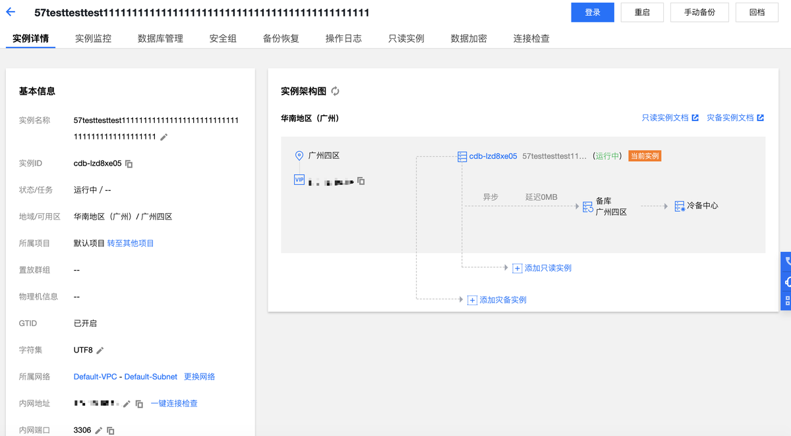
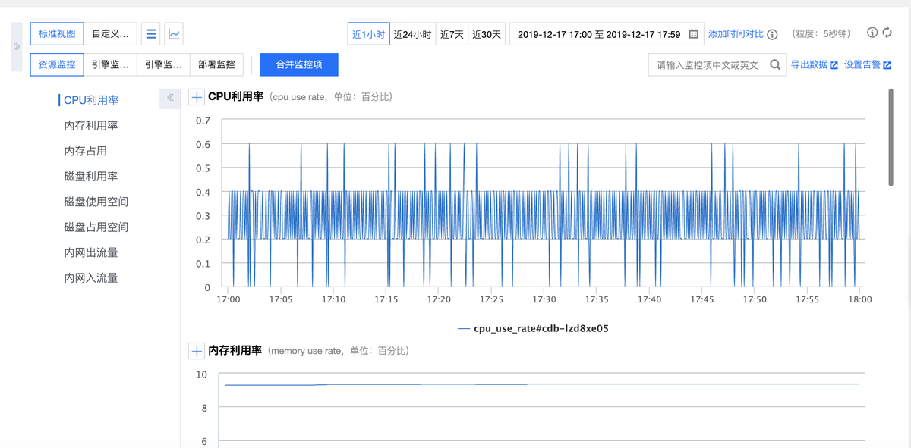

# 管理腾讯云MySQL数据库

点击数据库列表里的【管理】按钮，可以进入到数据库的管理页面，如上图5-15腾讯云控制台提供了实例详情、实例监控、数据库管理、安全组等多项可视化管理页面，下面让我们来逐一对上述功能做一个介绍

## 1、实例详情
在【实例详情】页面，用户可以查看和操作数据库的各种信息，如下图所示，可以对实例基本信息进行修改

## 2、实例监控
在【实例监控】页面，用户可以查看当前数据库运行的众多核心指标的监控，分为访问、负载、查询缓存、表、InnoDB、MyISAM 等维度的监控。

## 3、数据库管理
3.1、**数据库列表**

在【数据库管理】>【数据库列表】页面，用户可以将 SQL 文件导入到指定的数据库。

1.单击【数据导入】进入数据导入页面。

2.单击【新增文件】，选择本地 SQL 文件，确认上传即可，上传后的数据库会暂存到管理控制台，短时间内再次导入的时候无需再本地上传。

3.2、**参数设置**

在【数据库管理】>【参数设置】页面，用户可以对数据库的众多可修改参数进行设置和查看修改历史，并可以对【参数运行值】进行修改，这些参数是指MySQL配置的默认参数，腾讯云在官方参数进行了优化为用户提供默认参数

3.3、**帐号管理**

在【数据库管理】>【帐号管理】页面，用户可以对系统默认的 root 帐户进行管理，如修改权限，重置密码等，也可以创建帐号，删除帐号，并对各个账号进行权限管理。
## 4、安全组
在【安全组】页面，用户可以对用户的数据库进行安全组的配置操作
## 5、备份恢复
在【备份恢复】页面，用户可以进行下载 binlog 和冷备操作，用户可以直接点击【回档】、【手动备份】、【自动备份设置】来对数据库进行个性化恢复操作。
## 6、操作日志
在【操作日志】页面，用户可以查看和下载慢查询日志、错误日志、回档日志。
## 7、只读实例
在【只读实例】页面，用户可以创建一个或多个只读实例，以支持用户的读写分离和一主多从应用场景，可显著提高用户数据库的读负载能力。
## 8、连接检查
在【连接检查】页面，用户可以检测云数据库可能存在的连接访问问题，并根据提供的解决方法处理访问问题，以确保用户的云数据库能够正常访问。

