# 腾讯云MySQL数据库的备份和恢复
腾讯云数据库MySQL支持自动备份和手动备份两种备份方式。从备份类型上来看，可以分为两种一种是物理备份，即物理数据全拷贝；一种是逻辑备份，即SQL语句的备份。除逻辑备份只支持手动备份外，物理备份自动备份和手动备份均可。下面我们来看一下这两种备份类型对比：
<table>
    <tr>
        <th></th>
        <th>物理备份</th>
        <th>逻辑备份</th>
    </tr>
    <tr>
        <td>备份速度</td>
        <td>快</td>
        <td>需要执行sql和构建索引，速度较慢，备份过程中对实例造成压力，会加大主从延迟</td>
    </tr>
    <tr>
        <td>备份成功率</td>
        <td>高</td>
        <td>由于各种问题（错误视图等），可能导致备份失败</td>
    </tr>
    <tr>
        <td>可操作性</td>
        <td>较为简单</td>
        <td>需要执行sql和构建索引，相对复杂</td>
    </tr>
</table>
对比来看，物理备份是更优的选择，下面我们来分别讲一下如何自动备份和手动备份MySQL数据。

## 1、自动备份
1.在MySQL列表中，点击管理，进入数据库管理页面，选择【备份恢复】> 【自动备份设置】
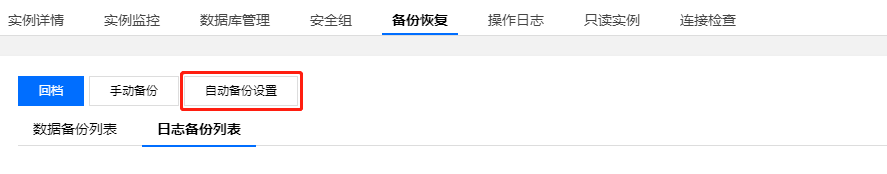

2.在弹出框中配置各项参数，点击【确定】即可完成备份：

(1)	备份周期：一般情况下，一周至少备份两次

(2)	备份时间：可自定义设置备份时间区间

(3)	数据备份保留时间：数据备份文件可以保留7天 - 732天，默认为7天。

(4)	日志备份保留时间：日志备份文件可以保留7天 - 732天，默认为7天。日志备份天数必须小于等于数据备份天数。
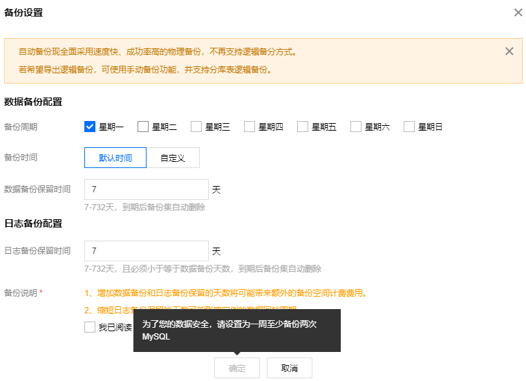

## 2、手动备份MySQL数据
1.在MySQL列表中，点击管理，进入数据库管理页面，选择【备份恢复】> 【自动备份设置】

2.在弹出的备份设置对话框，选择备份方式和对象，单击【确定】即可完成手动备份
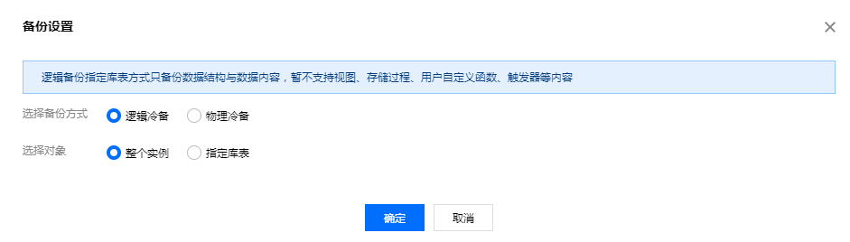

腾讯云数据库管理平台还提供了备份空间管理功能，你可以在概览页上对备份总计、备份趋势、备份统计进行查看，方便你随时随地监控自己的备份空间。


数据备份好之后，让我们来一起看一下如何使用备份文件恢复数据库，上面我们提到备份有逻辑备份和物理备份两种，同样的这两种的恢复方式也不一样。

## 3、物理备份恢复数据
1.**下载备份文件**

(1)	通过管理台手动下载：登陆MySQL控制台，在实例管理页选择【备份恢复】>【数据备份列表】页， 选择需要下载的备份，在操作列单击【下载】

(2)	通过wget命令进行下载：<br/>
wget -c '备份文件下载地址' -O 自定义文件名.xb
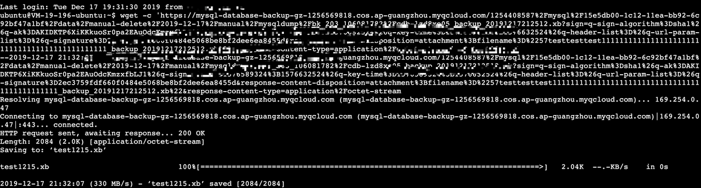

2.**解包备份文件**

(1)	使用 xbstream 命令将备份文件解包到目标目录。

(2)	xbstream -x -C /data < ~/test.xb
<ul>
    <li>本文目标目录以/data为例，您可根据实际情况替换为实际路径。</li>
    <li>~/test.xb替换为您的备份文件。</li>
</ul>
解包结果如下图所示：
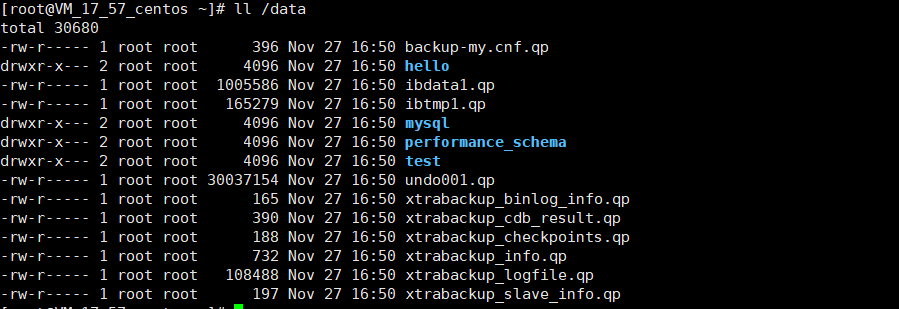

3.**解压备份文件**

(1)	下载qpress工具（解压工具）

(2)	wget http://www.quicklz.com/qpress-11-linux-x64.tar

(3)	解压qpress二进制文件

(4)	tar -xf qpress-11-linux-x64.tar -C /usr/local/bin

(5)	source /etc/profile

(6)	将目标目录下所有以.qp结尾的文件都解压出来

(7)	xtrabackup --decompress --target-dir=/data
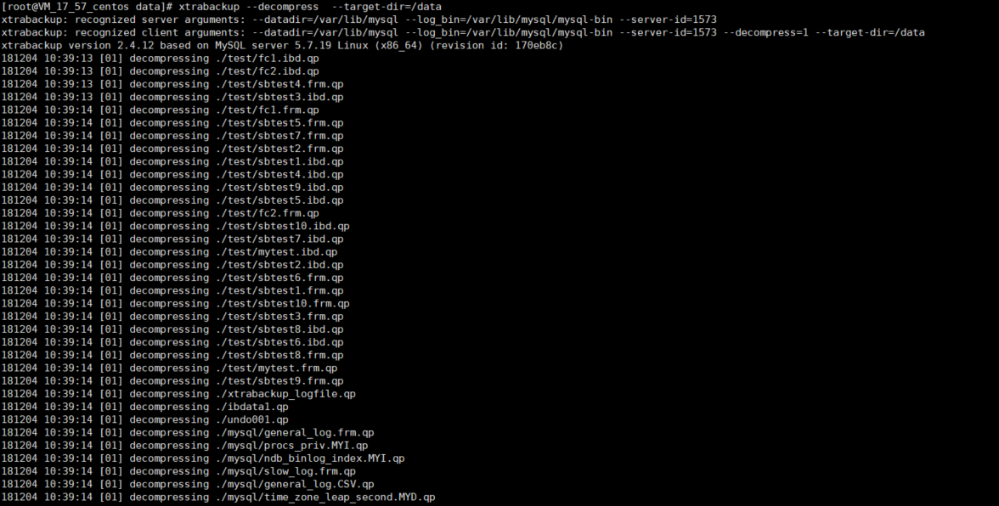

4.**prepare备份文件**

备份解压出来之后，需要进行apply log操作：xtrabackup --prepare  --target-dir=/data


5.**修改配置文件**

(1)	打开backup-my.cnf文件

(2)	vi /data/backup-my.cnf

(3)	由于存在的版本问题，请将解压文件backup-my.cnf中如下参数进行注释
<ul>
    <li>innodb_checksum_algorithm</li>
    <li>innodb_log_checksum_algorithm</li>
    <li>innodb_fast_checksum</li>
    <li>innodb_page_size</li>
    <li>innodb_log_block_size</li>
    <li>redo_log_version</li>
</ul>
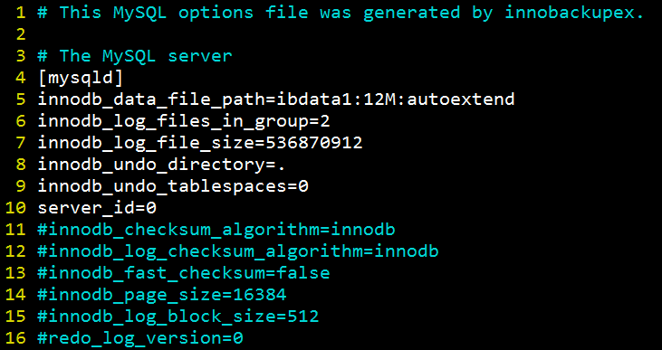

6.**修改文件属性**

修改文件属性，并检查文件所属为 mysql 用户。命令：chown -R mysql:mysql /data
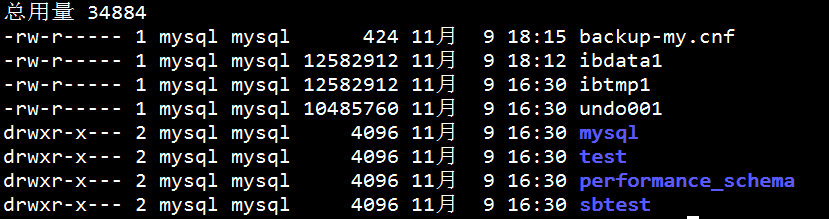

7.**启动mysqld进程并登陆验证**

(1)	启动mysqld进程：mysqld_safe --defaults-file=/data/backup-my.cnf --user=mysql --datadir=/data &

(2)	客户端登陆mysql验证

(3)	mysql  -uroot
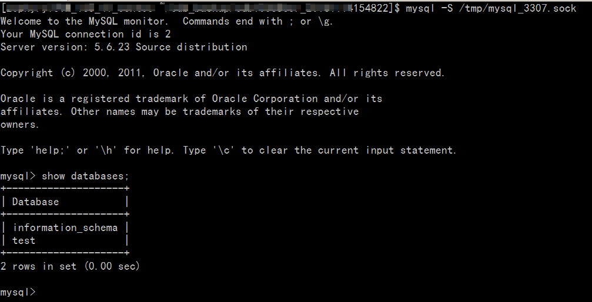

## 4.逻辑备份恢复数据库
前提条件：需要使用XtraBackup 工具

1.**下载备份文件**

(1)	登录云数据库 MySQL 控制台，在实例列表中，单击实例名或操作列的【管理】，进入实例管理页面。

(2)	在实例管理页，选择【备份恢复】>【数据备份列表】页， 选择需要下载的备份，在操作列单击【下载】。

(3)	在弹出的对话框，推荐您复制下载地址，并登录到云数据库所在 VPC 下的 CVM（Linux 系统） 中，运用 wget 命令进行内网高速下载，更高效：wget -c 'https://mysql-database-backup-bj-118.cos.ap-beijing.myqcloud.com/12427%2Fmysql%2F42d-11ea-b887-6c0b82b%2Fdata%2Fautomatic-delete%2F2019-11-28%2Fautomatic%2Fxtrabackup%2Fbk_204_10385%2Fcdb-1pe7bexs_backup_20191128044644.xb?sign=q-sign-algorithm%3Dsha1%26q-ak%3D1%26q-sign-time%3D1574269%3B1575417469%26q-key-time%3D1575374269%3B1517469%26q-header-list%3D%26q-url-param-list%3D%26q-signature%3Dfb8fad13c4ed&response-content-disposition=attachment%3Bfilename%3D%2141731_backup_20191128044644.xb%22&response-content-type=application%2Foctet-stream' -O test0.xb

2.**解包备份文件**

使用 xbstream 解包备份文件。
```
xbstream -x < test0.xb
```
解包结果如下所示：
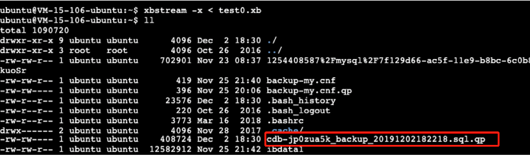

3.**解压备份文件**

(1)	通过如下命令下载 qpress 工具。

(2)	wget http://www.quicklz.com/qpress-11-linux-x64.tar

(3)	通过如下命令解出 qpress 二进制文件。

(4)	tar -xf qpress-11-linux-x64.tar -C /usr/local/bin

(5)	source /etc/profile

(6)	使用 qpress 解压备份文件。
```angular2html
qpress -d cdb-jp0zua5k_backup_20191202182218.sql.qp
```
解压结果如下所示：
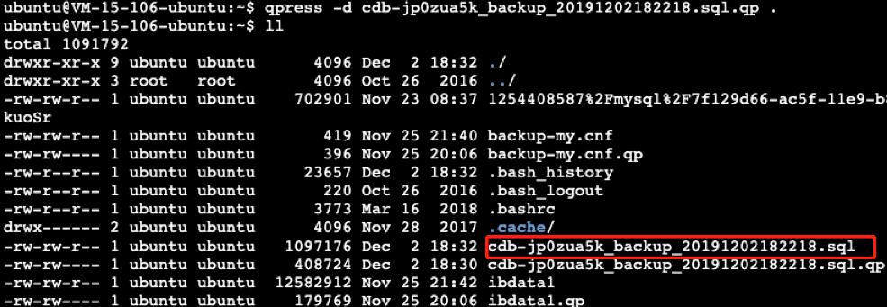

4.**导入数据库**
执行如下命令导入到数据库：
```angular2html
mysql -uroot -P3306 -h127.0.0.1 -p < cdb-jp0zua5k_backup_20191202182218.sql
```


