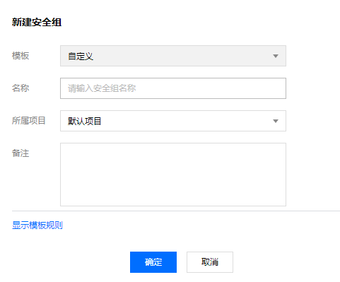
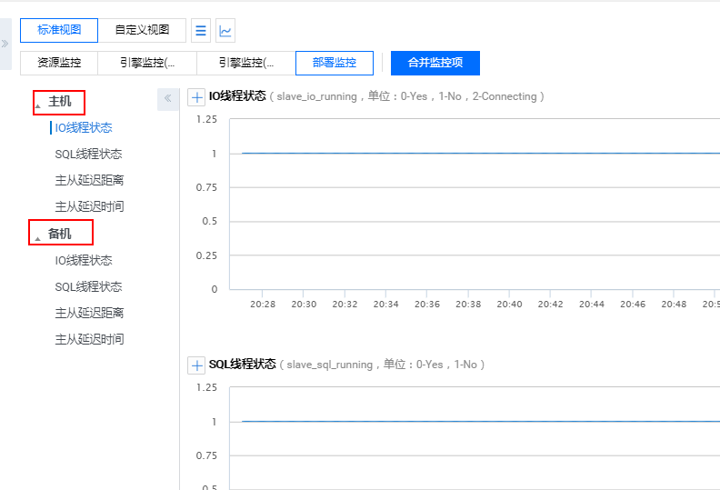

# 腾讯云MySQL数据库的安全性实现
本节将主要介绍一下云数据库安全组的内容。

安全组是一种有状态的包含过滤功能的虚拟防火墙，用于设置单台或多台云数据库的网络访问控制，是腾讯云提供的重要的网络安全隔离手段。安全组是一个逻辑上的分组，您可以将同一地域内具有相同网络安全隔离需求的云数据库实例加到同一个安全组内。云数据库与云服务器等共享安全组列表，安全组内基于规则匹配。下面我们来一起看一下如何操作安全组

## 1、创建安全组
1.登录 云服务器控制台。

2.在左侧导航选择【安全组】页签，单击【新建】。

3.在弹出来的对话框中选择【模板】创建或【自定义】创建，输入安全组的**名称**（例如 my-security-group），选择**所属项目**，选填**备注**，确认后单击【确定】即可。

## 2、为云数据库配置安全组
1.登录 云数据库 MySQL 控制台。

2.在实例列表中，选择需要配置安全组的实例，单击操作列的【管理】，进入实例管理页面。

3.选择【安全组】页签，单击【配置安全组】。

4.在弹出的对话框中选择需要绑定的安全组，单击【确认】，即可完成安全组绑定云数据库的操作。

## 3、删除安全组
1.登录云服务器控制台 安全组页面。

2.选择需要删除的安全组，在操作列选择【更多】>【删除】。

3.在弹出的对话框中，单击【确定】。若当前安全组有关联的 CVM 则需要先解除安全组才能进行删除。
## 4、克隆安全组
1.在云服务器控制台安全组页面中，在列表的操作列选择【更多】>【克隆】。

2.在弹出的对话框中，选定目标地域、目标项目后，单击【确定】。若新安全组需关联 CVM，请重新进行管理安全组内云服务器。
## 5、向安全组中添加规则
1.在云服务器控制台安全组页面中，选择需要更新的安全组，单击安全组 ID/名称。详细页面会显示此安全组的详细信息，以及可供您使用入站规则和出站规则的选项卡。

2.在入/出站规则页签上，单击【添加规则】。

3.在弹出的对话框中填写所需信息。例如，将来源/目标指定为0.0.0.0/0，协议端口指定为 TCP:3306，设置策略为【允许】，单击【完成】。单击【新增一行】可以同时配置多个规则。

## 6、导入导出安全组规则
1.在云服务器控制台安全组页面中，选择需要更新的安全组，单击安全组 ID/名称。详细页面会显示此安全组的详细信息，以及可供您使用入站规则和出站规则的选项卡。

2.从选在入/出站规则页签上，单击【导入规则】。

3.如果您已有规则，则推荐您先导出现有规则，因为规则导入将覆盖原有规则，如果原来为空规则，则可先导出模板，编辑好模板文件后，在弹出的会话框中单击【选择文件】选择您的模板文件，单击【开始导入】即可。

对于腾讯云数据库的安全实现中，腾讯云还提供了监控和告警的功能来保障安全性能，下面我们来介绍一下这两块内容。

## 7、监控功能
为方便用户查看和掌握实例的运行信息，云数据库 MySQL 提供了丰富的性能监控项与便捷的监控功能（自定义视图、时间对比、合并监控项等）。

云数据库 MySQL 包括资源监控、引擎监控（普通）、引擎监控（扩展）、部署监控4种监控类型，通过查看不同监控类型的指标，可快速、准确的了解实例性能及运行状况。

1.资源监控：提供 CPU、内存、磁盘及网络相关的监控数据。

2.引擎监控（普通）：提供连接数、锁信息、热点表、慢查询等相关的监控数据，方便您诊断故障及性能优化。

3.引擎监控（扩展）：提供更为丰富引擎相关的监控指标，协助您最大限度发现数据库存在或潜在的健康问题。

4.部署监控：提供主从延迟相关的监控指标。部署监控分为主机和备机：
<ul>
    <li><b>部署监控为主机</b>：当监控实例为主实例时，由于其主实例不为任何实例的从实例，因此其主机下复制相关的监控数据无效，此时其 IO、SQL 线程状态为未启动。仅当监控实例为灾备实例和只读实例时，其对应复制相关的监控数据才有效，且 IO、SQL 线程才是启动的状态。</li>
    <li><b>部署监控为备机</b>：高可用版的主实例与灾备实例默认为一主一从架构，因此，仅当监控实例为主实例及灾备实例时，其备机下复制相关的监控数据才有效。用于反映主实例、灾备实例与其隐藏从节点的延迟距离及时间，建议关注备机下相关的监控数据，若主实例及灾备实例存在故障时，其监控实例对应隐藏的从节点可快速提升为主实例。</li>
</ul>

## 8、支持监控的实例类型
云数据库 MySQL 支持主实例、只读实例和灾备实例的监控，并为每个实例提供独立的监控视图供查询。

云数据库 MySQL 包括资源监控、引擎监控（普通）、引擎监控（扩展）、部署监控4种监控类型，通过查看不同监控类型的指标，可快速、准确的了解实例性能及运行状况。

1.资源监控：提供 CPU、内存、磁盘及网络相关的监控数据。

2.引擎监控（普通）：提供连接数、锁信息、热点表、慢查询等相关的监控数据，方便您诊断故障及性能优化。

3.引擎监控（扩展）：提供更为丰富引擎相关的监控指标，协助您最大限度发现数据库存在或潜在的健康问题。

4.部署监控：提供主从延迟相关的监控指标。部署监控分为主机和备机：
<ul>
    <li><b>部署监控为主机</b>：当监控实例为主实例时，由于其主实例不为任何实例的从实例，因此其主机下复制相关的监控数据无效，此时其 IO、SQL 线程状态为未启动。仅当监控实例为灾备实例和只读实例时，其对应复制相关的监控数据才有效，且 IO、SQL 线程才是启动的状态。</li>
    <li><b>部署监控为备机</b>：高可用版的主实例与灾备实例默认为一主一从架构，因此，仅当监控实例为主实例及灾备实例时，其备机下复制相关的监控数据才有效。用于反映主实例、灾备实例与其隐藏从节点的延迟距离及时间，建议关注备机下相关的监控数据，若主实例及灾备实例存在故障时，其监控实例对应隐藏的从节点可快速提升为主实例。</li>
</ul>

自2018年08月11日起，云数据库 MySQL 监控粒度实行自适应策略，暂不支持监控粒度的自定义选择。监控粒度自适应策略如下：
<table>
    <tr>
        <th>时间跨度</th>
        <th>监控粒度</th>
        <th>自适应说明</th>
        <th>保留时长</th>
    </tr>
    <tr>
        <td>(0h, 4h]</td>
        <td>5s</td>
        <td>时间跨度在4小时内，监控粒度为5秒</td>
        <td>1天</td>
    </tr>
    <tr>
        <td>(4h, 2d]</td>
        <td>1min</td>
        <td>时间跨度超过4小时，但在2天内，监控粒度调整为1分钟</td>
        <td>15天</td>
    </tr>
    <tr>
        <td>(2d, 10d]</td>
        <td>5min</td>
        <td>时间跨度超过2天，但在10天内，监控粒度调整为5分钟</td>
        <td>31天</td>
    </tr>
    <tr>
        <td>(10d, 30d]</td>
        <td>1h</td>
        <td>时间跨度超过10天，但在30天内，监控粒度调整为1小时</td>
        <td>62天</td>
    </tr>
</table>

关于监控指标，腾讯云提供了以下监控指标：
<table>
    <tr>
        <th width=150>指标中文名</th>
        <th width=150>指标英文名</th>
        <th width=30>单位</th>
        <th>指标说明</th>
    </tr>
    <tr>
        <td>每秒执行操作数</td>
        <td>qps</td>
        <td>次/秒</td>
        <td>数据库每秒执行的 SQL 数（含 insert、select、update、delete、replace），QPS 指标主要体现 TencentDB 实例的实际处理能力</td>
    </tr>
    <tr>
        <td>慢查询数</td>
        <td>slow_queries</td>
        <td>次</td>
        <td>查询时间超过 long_query_time 秒的查询的个数</td>
    </tr>
    <tr>
        <td>全表扫描数</td>
        <td>select_scan</td>
        <td>次/秒</td>
        <td>执行全表搜索查询的数量</td>
    </tr>
    <tr>
        <td>查询数</td>
        <td>select_count</td>
        <td>次/秒</td>
        <td>每秒查询数</td>
    </tr>
    <tr>
        <td>更新数</td>
        <td>com_update</td>
        <td>次/秒</td>
        <td>每秒更新数</td>
    </tr>
    <tr>
        <td>删除数</td>
        <td>com_delete</td>
        <td>次/秒</td>
        <td>每秒删除数</td>
    </tr>
    <tr>
        <td>插入数</td>
        <td>com_insert</td>
        <td>次/秒</td>
        <td>每秒插入数</td>
    </tr>
    <tr>
        <td>覆盖数</td>
        <td>com_replace</td>
        <td>次/秒</td>
        <td>每秒覆盖数</td>
    </tr>
    <tr>
        <td>总请求数</td>
        <td>queries</td>
        <td>次/秒</td>
        <td>所有执行的 SQL 语句，包括 set，show 等</td>
    </tr>
    <tr>
        <td>当前打开连接数</td>
        <td>threads_connected</td>
        <td>个</td>
        <td>当前打开的连接的数量</td>
    </tr>
    <tr>
        <td>连接数利用率</td>
        <td>connection_use_rate</td>
        <td>%</td>
        <td>当前打开连接数/最大连接数</td>
    </tr>
    <tr>
        <td>查询使用率</td>
        <td>query_rate</td>
        <td>%</td>
        <td>每秒执行操作数 QPS/推荐每秒操作数</td>
    </tr>
    <tr>
        <td>磁盘使用空间</td>
        <td>real_capacity</td>
        <td>MB</td>
        <td>仅包括 MySQL 数据目录，不含 binlog、relaylog、undolog、errorlog、slowlog 日志空间</td>
    </tr>
    <tr>
        <td>磁盘占用空间</td>
        <td>capacity</td>
        <td>MB</td>
        <td>包括 MySQL 数据目录和 binlog、relaylog、undolog、errorlog、slowlog 日志空间</td>
    </tr>
    <tr>
        <td>发送数据量</td>
        <td>bytes_sent</td>
        <td>MB/秒</td>
        <td>每秒发送的字节数</td>
    </tr>
    <tr>
        <td>接收数据量</td>
        <td>bytes_received</td>
        <td>MB/秒</td>
        <td>每秒接受的字节数</td>
    </tr>
    <tr>
        <td>磁盘利用率</td>
        <td>volume_rate</td>
        <td>%</td>
        <td>磁盘使用空间/实例购买空间</td>
    </tr>
    <tr>
        <td>查询缓存命中率</td>
        <td>qcache_hit_rate</td>
        <td>%</td>
        <td>查询缓存命中率</td>
    </tr>
    <tr>
        <td>查询缓存使用率</td>
        <td>qcache_use_rate</td>
        <td>%</td>
        <td>查询缓存使用率</td>
    </tr>
    <tr>
        <td>等待表锁次数</td>
        <td>table_locks_waited</td>
        <td>次/秒</td>
        <td>不能立即获得的表的锁的次数</td>
    </tr>
    <tr>
        <td>临时表数量</td>
        <td>created_tmp_tables</td>
        <td>次/秒</td>
        <td>创建临时表的数量</td>
    </tr>
    <tr>
        <td>innodb 缓存命中率</td>
        <td>innodb_cache_hit_rate</td>
        <td>%</td>
        <td>Innodb 引擎的缓存命中率</td>
    </tr>
    <tr>
        <td>innodb 缓存使用率</td>
        <td>innodb_cache_use_rate</td>
        <td>%</td>
        <td>Innodb 引擎的缓存使用率</td>
    </tr>
    <tr>
        <td>innodb 读磁盘数量</td>
        <td>innodb_os_file_reads</td>
        <td>次/秒</td>
        <td>Innodb 引擎每秒读磁盘文件的次数</td>
    </tr>
    <tr>
        <td>innodb 写磁盘数量</td>
        <td>innodb_os_file_writes</td>
        <td>次/秒</td>
        <td>Innodb 引擎每秒写磁盘文件的次数</td>
    </tr>
    <tr>
        <td>innodb fsync 数量</td>
        <td>innodb_os_fsyncs</td>
        <td>次/秒</td>
        <td>Innodb 引擎每秒调用 fsync 函数次数</td>
    </tr>
    <tr>
        <td>当前 Innodb 打开表的数量</td>
        <td>innodb_num_open_files</td>
        <td>个</td>
        <td>Innodb 引擎当前打开表的数量</td>
    </tr>
    <tr>
        <td>myisam 缓存命中率</td>
        <td>key_cache_hit_rate</td>
        <td>%</td>
        <td>myisam 引擎的缓存命中率</td>
    </tr>
    <tr>
        <td>myisam 缓存使用率</td>
        <td>key_cache_use_rate</td>
        <td>%</td>
        <td>myisam 引擎的缓存使用率</td>
    </tr>
    <tr>
        <td>CPU 利用率</td>
        <td>cpu_use_rate</td>
        <td>%</td>
        <td>允许闲时超用，CPU 利用率可能大于100%</td>
    </tr>
    <tr>
        <td>内存利用率</td>
        <td>memory use rate</td>
        <td>%</td>
        <td>允许闲时超用，内存利用率可能大于100%</td>
    </tr>
    <tr>
        <td>内存占用</td>
        <td>memory_use</td>
        <td>MB</td>
        <td>允许闲时超用，实际内存占用可能大于购买规格</td>
    </tr>
    <tr>
        <td>临时文件数量</td>
        <td>created_tmp_files</td>
        <td>次/秒</td>
        <td>每秒创建临时文件的次数</td>
    </tr>
    <tr>
        <td>已经打开的表数</td>
        <td>opened_tables</td>
        <td>个</td>
        <td>实例维度</td>
    </tr>
    <tr>
        <td>提交数</td>
        <td>com_commit</td>
        <td>次/秒</td>
        <td>每秒提交次数</td>
    </tr>
    <tr>
        <td>回滚数</td>
        <td>com_rollback</td>
        <td>次/秒</td>
        <td>每秒回滚次数</td>
    </tr>
    <tr>
        <td>已创建的线程数</td>
        <td>threads_created</td>
        <td>个</td>
        <td>创建用来处理连接的线程数</td>
    </tr>
    <tr>
        <td>运行的线程数</td>
        <td>threads_running</td>
        <td>个</td>
        <td>激活的（非睡眠状态）线程数</td>
    </tr>
    <tr>
        <td>最大连接数</td>
        <td>max_connections</td>
        <td>个</td>
        <td>最大连接数</td>
    </tr>
    <tr>
        <td>磁盘临时表数量</td>
        <td>created_tmp_disk_tables</td>
        <td>次/秒</td>
        <td>每秒创建磁盘临时表的次数</td>
    </tr>
    <tr>
        <td>读下一行请求数</td>
        <td>handler_read_rnd_next</td>
        <td>次/秒</td>
        <td>每秒读取下一行的请求次数</td>
    </tr>
    <tr>
        <td>内部回滚数</td>
        <td>handler_rollback</td>
        <td>次/秒</td>
        <td>每秒事务被回滚的次数</td>
    </tr>
    <tr>
        <td>内部提交数</td>
        <td>handler_commit</td>
        <td>次/秒</td>
        <td>每秒事务提交的次数</td>
    </tr>
    <tr>
        <td>InnoDB 空页数</td>
        <td>innodb_buffer_pool_pages_free</td>
        <td>个</td>
        <td>Innodb 引擎内存空页个数</td>
    </tr>
    <tr>
        <td>InnoDB 总页数</td>
        <td>innodb_buffer_pool_pages_total</td>
        <td>个</td>
        <td>Innodb 引擎占用内存总页数</td>
    </tr>
    <tr>
        <td>InnoDB 逻辑读</td>
        <td>innodb_buffer_pool_read_requests</td>
        <td>次/秒</td>
        <td>Innodb 引擎每秒已经完成的逻辑读请求次数</td>
    </tr>
    <tr>
        <td>InnoDB 物理读</td>
        <td>innodb_buffer_pool_reads</td>
        <td>次/秒</td>
        <td>Innodb 引擎每秒已经完成的物理读请求次数</td>
    </tr>
    <tr>
        <td>InnoDB 读取量</td>
        <td>innodb_data_read</td>
        <td>Byte/秒</td>
        <td>Innodb 引擎每秒已经完成读取数据的字节数</td>
    </tr>
    <tr>
        <td>InnoDB 总读取量</td>
        <td>innodb_data_reads</td>
        <td>次/秒</td>
        <td>Innodb 引擎每秒已经完成读取数据的次数</td>
    </tr>
    <tr>
        <td>InnoDB 总写入量</td>
        <td>innodb_data_writes</td>
        <td>次/秒</td>
        <td>Innodb 引擎每秒已经完成写数据的次数</td>
    </tr>
    <tr>
        <td>InnoDB 写入量</td>
        <td>innodb_data_written</td>
        <td>Byte/秒</td>
        <td>Innodb 引擎每秒已经完成写数据的字节数</td>
    </tr>
    <tr>
        <td>InnoDB 行删除量</td>
        <td>innodb_rows_deleted</td>
        <td>次/秒</td>
        <td>Innodb 引擎每秒删除的行数</td>
    </tr>
    <tr>
        <td>InnoDB 行插入量</td>
        <td>innodb_rows_inserted</td>
        <td>次/秒</td>
        <td>Innodb 引擎每秒插入的行数</td>
    </tr>
    <tr>
        <td>InnoDB 行更新量</td>
        <td>innodb_rows_updated</td>
        <td>次/秒</td>
        <td>Innodb 引擎每秒更新的行数</td>
    </tr>
    <tr>
        <td>InnoDB 行读取量</td>
        <td>innodb_rows_read</td>
        <td>次/秒</td>
        <td>Innodb 引擎每秒读取的行数</td>
    </tr>
    <tr>
        <td>InnoDB 平均获取行锁时间</td>
        <td>innodb_row_lock_time_avg</td>
        <td>毫秒</td>
        <td>Innodb 引擎行锁定的平均时长</td>
    </tr>
    <tr>
        <td>InnoDB 等待行锁次数</td>
        <td>innodb_row_lock_waits</td>
        <td>次/秒</td>
        <td>Innodb 引擎每秒等待行锁定的次数</td>
    </tr>
    <tr>
        <td>键缓存内未使用的块数量</td>
        <td>key_blocks_unused</td>
        <td>个</td>
        <td>myisam 引擎未使用键缓存块的个数</td>
    </tr>
    <tr>
        <td>键缓存内使用的块数量</td>
        <td>key_blocks_used</td>
        <td>个</td>
        <td>myisam 引擎已使用键缓存块的个数</td>
    </tr>
    <tr>
        <td>键缓存读取数据块次数</td>
        <td>key_read_requests</td>
        <td>次/秒</td>
        <td>myisam 引擎每秒读取键缓存块的次数</td>
    </tr>
    <tr>
        <td>硬盘读取数据块次数</td>
        <td>key_reads</td>
        <td>次/秒</td>
        <td>myisam 引擎每秒读取硬盘数据块的次数</td>
    </tr>
    <tr>
        <td>数据块写入键缓冲次数</td>
        <td>key_write_requests</td>
        <td>次/秒</td>
        <td>myisam 引擎每秒写键缓存块的次数</td>
    </tr>
    <tr>
        <td>数据块写入磁盘次数</td>
        <td>key_writes</td>
        <td>次/秒</td>
        <td>myisam 引擎每秒写硬盘数据块的次数</td>
    </tr>
    <tr>
        <td>主从延迟距离</td>
        <td>master_slave_sync_distance</td>
        <td>MB</td>
        <td>主从 binlog 差距</td>
    </tr>
    <tr>
        <td>主从延迟时间</td>
        <td>seconds_behind_master</td>
        <td>秒</td>
        <td>主从延迟时间</td>
    </tr>
    <tr>
        <td>IO 线程状态</td>
        <td>slave_io_running</td>
        <td>状态值（0-Yes，1-No，2-Connecting）</td>
        <td>IO 线程运行状态</td>
    </tr>
    <tr>
        <td>SQL 线程状态</td>
        <td>slave_sql_running</td>
        <td>状态值（0-Yes，1-No）</td>
        <td>SQL 线程运行状态</td>
    </tr>
</table>

## 9、告警功能
您可以创建告警用于在云产品状态改变时触发警报并发送相关消息。创建的告警会根据每隔一段时间监控的指标相对于给定阈值的情况判断是否需要触发相关通知。
状态改变触发告警后，您可以及时进行相应的预防或补救措施。因此，合理地创建告警能帮助您提高应用程序的健壮性和可靠性。

当用户需要针对某个产品的某个状态发送告警时，需要先创建告警策略。告警策略包括名称、类型和告警触发条件三个必要组成部分。每个告警策略是一系列告警触发条件的集合，告警触发条件是“或”关系，即一个条件满足，就会发送告警。告警将发送至告警策略关联的所有人，用户接收到告警后可以及时查看并采取相应措施。

那下面我们来具体看一下告警功能的产品步骤：

1.登录 云监控控制台，在左侧导航选择【告警配置】>【告警策略】页。

2.在告警策略列表页中，单击【新增】。

3.在新建策略页中，设置策略名称、策略类型、所属产品、告警对象、触发条件等内容。
<ul>
    <li>告警触发条件是指标、比较关系、阈值、统计周期和持续周期组成的一个有语义的条件。例如：指标为磁盘使用率、比较关系为>、阈值为80%、统计周期为5分钟、持续周期为2个周期。表示：每5分钟收集一次磁盘使用率数据，若某台云数据库的磁盘使用率连续两次大于80%则触发告警。</li>
    <li>可通过选择对象所在的地域或搜索对象的实例 ID 找到需要关联的对象实例</li>
</ul>

4.确认无误后，单击【完成】即可。

5.创建完告警策略后，我们可以为其关联一些告警对象，对象达到告警触发条件时会发送告警：
<ul>
    <li>在告警策略列表页中，单击告警策略名称，进入管理告警策略页。</li>
    <li>在管理告警策略页中，单击【新增对象】。</li>
    <li>选择您需要关联的云产品，单击【应用】，即可关联告警对象。</li>
</ul>

6.接下来我们需要设置一下接收告警的对象
<ul>
    <li>在告警策略列表页中，单击告警的策略名称。</li>
    <li>在管理告警策略页中，选择【告警接收对象】栏，单击【编辑】。</li>
    <li>选择需要通知的用户组，设置相关信息，单击【保存】，即可完成告警接收对象的设置。</li>
</ul>

