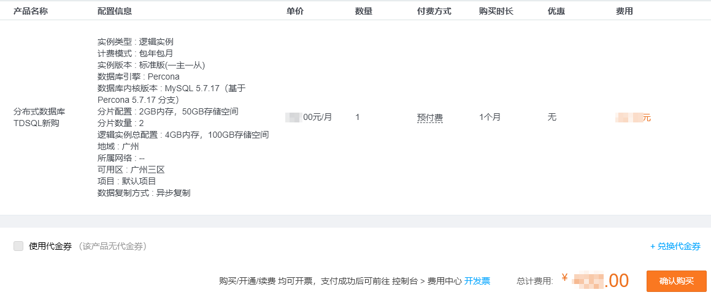
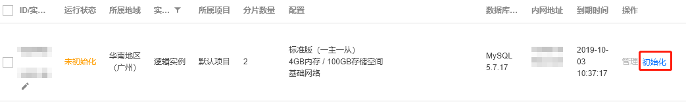
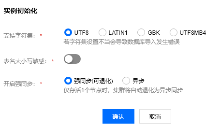
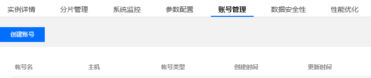
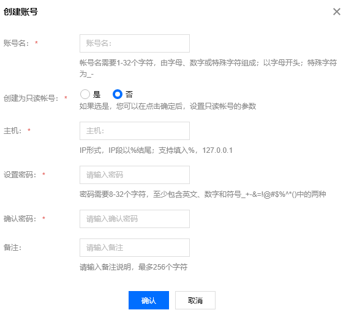
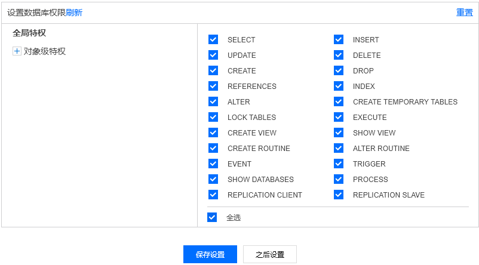
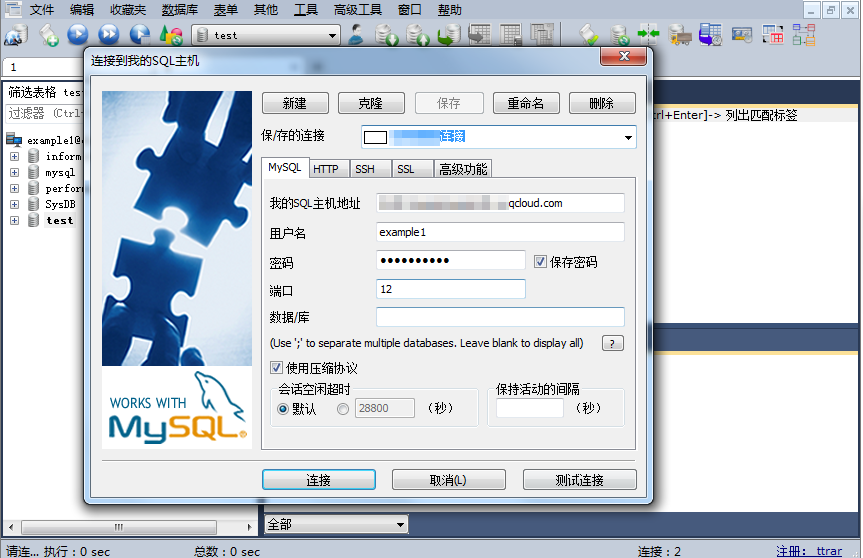
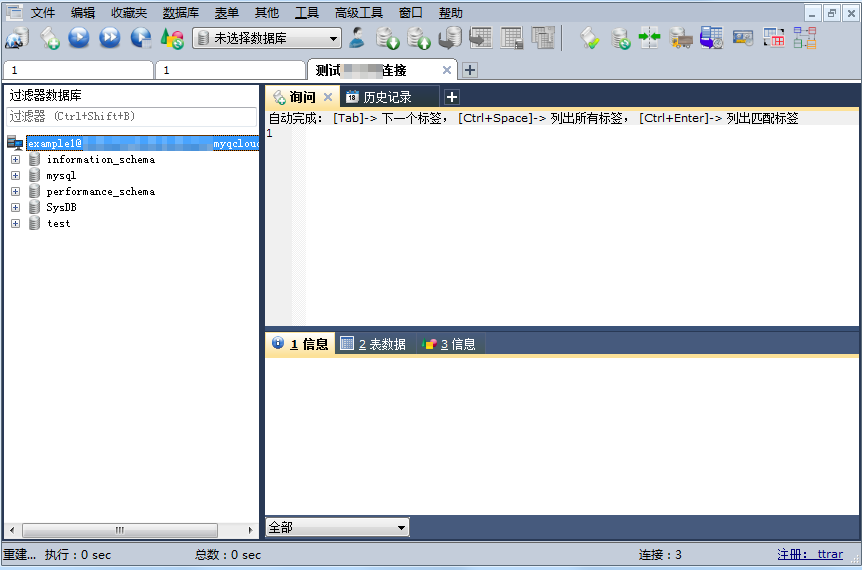
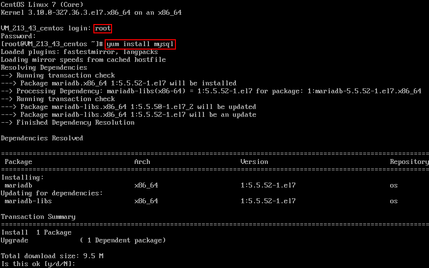
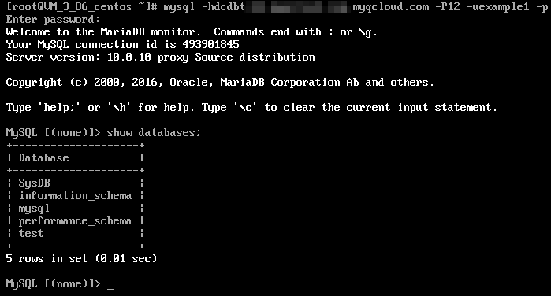

# 创建腾讯云TDSQL数据库
## 1、创建实例
我们首先来看一下如何通过TDSQL 控制台创建实例的操作：

1.登录 TDSQL 控制台，单击【新建】进入购买页。

2.根据需求选择对应的地域、网络类型及分片配置，单击【立即购买】。
* 处在不同地域的云产品网络无法互通。
* VPC 网络选择后不可更改。

3.确认无误后，单击【确认购买】进行支付。



4.支付成功后，返回 TDSQL 实例列表，待实例状态变为【未初始化】，即可进行实例初始化操作。

## 2、初始化
接下来我们要对示例进行初始化：

1.登录TDSQL 控制台，在实例列表选择未初始化的实例，在操作列单击【初始化】。



2.在弹出的初始化对话框，根据需要选择配置后，单击【确认】进行初始化。
* 支持字符集：选择 MySQL 数据库支持的字符集。
* 表名大小写敏感：数据库表名大小写是否敏感。
* 开启强同步：开启强同步可以保证在主机故障时备机数据的一致性，至少需要2个节点方可正常运行。



3.待实例状态变为【运行中】，表明初始化完成，即可进行连接数据库操作。

## 3、连接操作
实例初始化之后我们就可以对示例进行连接，首先我们需要创建TDSQL账户，流程如下：

1.登陆TDSQL 控制台，选择所需实例，单击实例名或操作列的【管理】，进入实例管理页面。

2.选择【账号管理】页，单击【创建账号】。



3.在弹出的对话框，输入账号名、主机、密码、备注，确认无误后单击【确认】。主机名实际是网络出口地址，支持%的匹配方式，代表所有 IP 均可访问。



4.进入修改权限对话框，根据需求分配权限后，单击【保存设置】即可完成权限分配。若需稍后设置权限，单击【之后设置】即可。

左边导航栏提供完全兼容 MySQL 管理方式的图形化界面，权限管理可以细化到列级。



5.返回账号列表，单击【修改权限】可以修改用户权限，单击【克隆账号】可以完全复制当前账号权限来新建一个帐号，单击【更多】可以重置密码和删除账号。


账户创建完之后我们还需要获取外网地址，然后通过第三方工具和驱动程序进行连接TDSQL：
* Windows 端，以命令行连接、客户端连接和 JDBC 驱动连接三种方式为例。
* Linux 端，以命令行连接为例。

下面一起来看一下针对不同的端如何进行连接。

### 3.1、windows端
1.windows命令行连接

(1)	打开 Windows 命令行，在 MySQL 的正确路径下输入以下命令。
```apacheconfig
mysql -h外网地址 -P端口号 -u用户名  -p
Enter password: **********（输入密码）
```
(2)	将相关代码正确输入后，显示如下信息，成功连接数据库，下一步即可进行数据库内相关操作。
```apacheconfig
Welcome to the MySQL monitor.  Commands end with ; or \g.
```

2.windows客户端连接

(1)	下载一个标准的 SQL 客户端，例如 MySQL Workbench 、SQLyog 等，本文以 SQLyog 为例。

(2)	打开 SQLyog，选择【文件】>【新连接】，输入对应的主机地址、端口、用户名和密码，单击【连接】。
* 我的SQL主机地址：输入前面获得的外网地址。
* 用户名：输入前面创建的账户名。
* 密码：输入账户对应的密码。
* 端口：输入外网地址对应的端口。



(3)	连接成功页面如下图所示，在此页面即可进行数据库内相关操作。



3.Windows JDBC驱动连接TDSQL 支持程序驱动连接

本文以 Java 使用 JDBC Driver for MySQL (Connector/J) 连接 TDSQL 为例。

(1)	在MySQL官网 下载一个 JDBC 的 jar 包，将其导入 Java 引用的 Library 中。

(2)	调用 JDBC 代码如下：
```apacheconfig
public static final String url = "外网地址";
public static final String name = "com.mysql.jdbc.Driver"; //调用 JDBC 驱动
public static final String user = "用户名";
public static final String password = "密码";
//JDBC
Class.forName("com.mysql.jdbc.Driver"); 
Connection conn=DriverManager.getConnection("url, user, password");
//
conn.close();
```
(3)	连接成功后，下一步即可进行其他数据库内操作。

**说明**：因 TDSQL 在分表和插入数据时需要标记 shardkey，所以无法用 JDBC 调用这些操作。

### 3.2、Linux端

1.Linux 命令行连接

(1)	登录 Linux 后，输入命令 yum install mysql，利用 CentOS 自带的包管理软件 Yum 在腾讯云镜像源中下载安装 MySQL 客户端。



(2)	命令行显示 complete 后，表示 MySQL 客户端安装完成。

(3)	输入命令 mysql -h外网地址 -P端口 -u用户名 -p 连接 TDSQL，下一步即可进行分表操作。

(4)	下图以show databases;为例。




