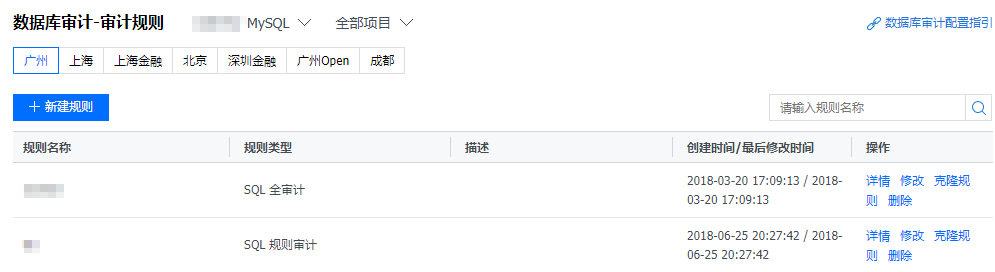
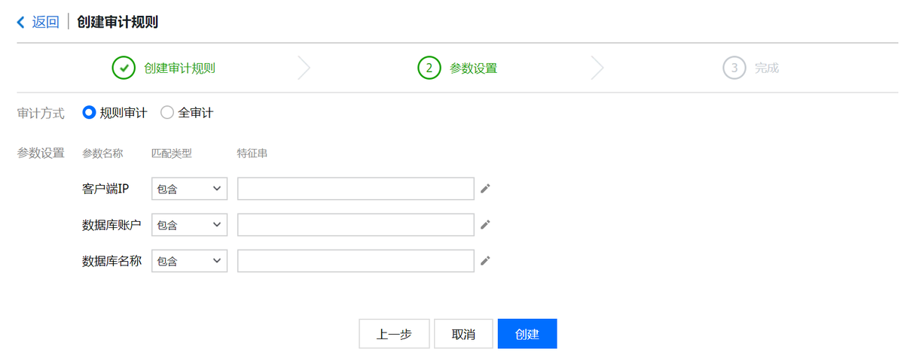
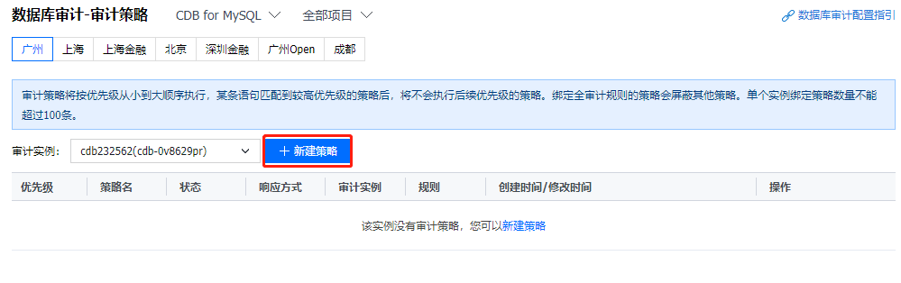
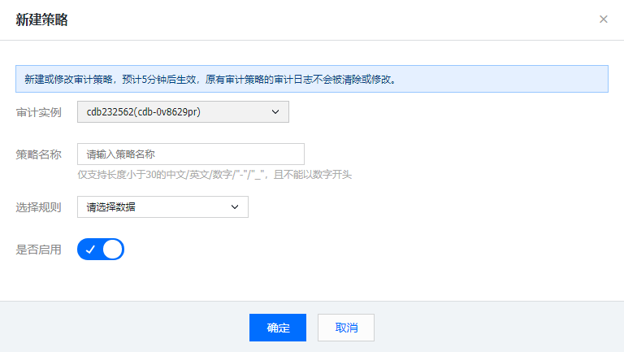
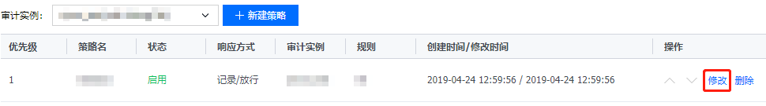
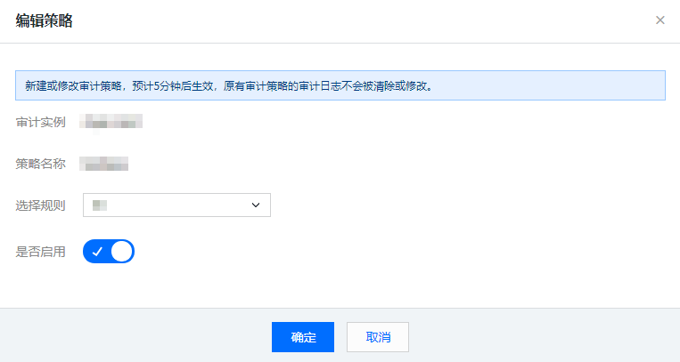
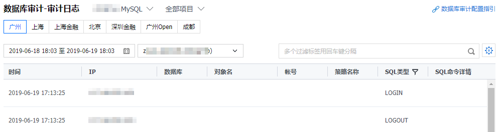
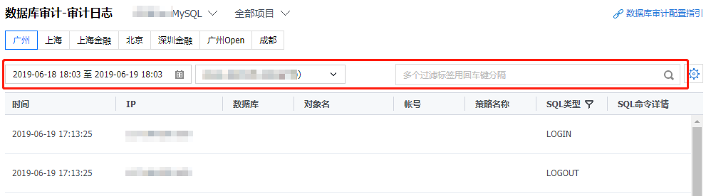

# 云数据审计
数据库审计是腾讯云自主研发的一款专业、高效、全面、实时监控数据库安全的审计产品，数据库审计能够实时记录腾讯云数据库活动，对数据库操作进行细粒度审计的合规性管理，对数据库遭受到的风险行为进行告警，针对数据库 SQL 注入、异常操作等数据库风险行为进行记录与告警，为您的云数据库提供完善的安全诊断和管理功能，提高数据资产安全。其具有以下特点：

1.**全面审计**

数据库访问的全部记录，最大程度满足用户审计需求，可追溯对应用者的身份和行为，并提供海量数据存储，可根据用户要求提供长期备份。

2.**精准审计**

用户可设置规则，只保证规则匹配到的审计规则有数据保存，规则也可以设置为全量审计。

3.**高效审计**

与目前其他通过旁路做审计检查方式不同，腾讯云数据库通过内核插件进行上报，对性能影响低于2%。

4.**高效分析**

提供用户、IP、客户端工具、访问时间、操作对象、SQL 操作类型、成功与否、访问时长、影响行数等多种检索条件的快速分析与检索，30多亿级数据6 - 8秒内响应。

## 1、如何使用腾讯云审计服务
下面我们来一起看一下如何使用腾讯云的审计服务：

1.**创建审计规则**

(1)	登录数据库审计控制台，在左侧导航选择【审计规则】页。

(2)	单击【新建规则】进入创建页，填写规则名称，单击【下一步】。

(3)	选择所需的审计方式和参数，单击【创建】即可。

2.**创建审计策略**

(1)	在左侧导航选择【审计策略】页，单击【新建策略】进入创建页。

(2)	选择目标审计实例和所需启动的审计规则，单击【确定】即可启动。

(3)	返回审计策略列表，单击策略【操作】列的【修改】。

(4)	在弹出的对话框，单击【是否启用】滑块，可启动或关闭审计规则。

(5)	在左侧导航选择【审计日志】页，可查看审计效果。

3.**基于条件定位**

(1)	在审计日志页，单击时间框，选择时间段，可查看所选时间段内相关审计效果。

(2)	单击审计实例框，选择所需实例，可查看相关审计效果。

(3)	在右侧文本框输入关键标签进行搜索，可查看相关审计效果。
**说明**：在文本框输入多组关键标签进行搜索，使用回车键分割关键标签。

(4)	在右侧文本框输入关键 SQL 命令组合进行搜索，可查看相关审计效果。
说明：可在文本框输入 SQL 命令、客户端 IP、帐号、数据库、对象名、策略名、执行时间范围、影响行数等关键组合信息。

4.**SQL 审计规则**

支持以下类型设置：
客户端 IP、数据库帐户、数据库名，支持【包含、不包含、等于、不等于】方式匹配。
全量审计规则为特殊规则，启用后审计所有语句。

* 每个规则内部不同类型为追加限制条件关系，即与（&&）关系。
* 如用户名指定为 user1，匹配类型为等于，数据库名指定为 test， 匹配类型为等于，那么仅审计 user1 用户对 test 库的动作，其它忽略。
* 规则与规则之间为或（||）关系 。
* 每个实例可以指定一个或多个审计规则，只要符合任意一个规则，就应该审计。如 A 规则指定只审计 user1 的执行时间 >= 1秒的操作，B 规则审计 user1 并且执行时间 < 1的语句，那么最终对 user1 所有语句都要审计。

对于客户端 IP、数据库帐户、数据库名支持【包含、不包含、等于、不等于】运算，一次只支持一个运算符设置，如“不等于”。
“等于”和“不等于”时，可以写多个值，多个值之间用逗号分隔，包含、不包含只能写唯一值。如运算符为”相等“，值可以为 user1,user2,user3。

如果是以下的表对象类型的语句：

* SQLCOM_SELECT, SQLCOM_CREATE_TABLE, SQLCOM_CREATE_INDEX, SQLCOM_ALTER_TABLE,
* SQLCOM_UPDATE, SQLCOM_INSERT, SQLCOM_INSERT_SELECT, SQLCOM_DELETE, SQLCOM_TRUNCATE, SQLCOM_DROP_TABLE

对这一类型动作，数据库名以语句中实际操作的数据库名为准。例如，当前是 use db3 库，语句为：select *from db1.test,db2.test;
那么会以 db1 和 db2 作为目标库进行规则判断，如果规则配置要审计 db1 的库则会进行审计，规则配置要审计 db3 的库则不会进行审计。
如果不是上面的表对象类型语句，以当前 use 的库作为目标库进行判断。如当前库为 use db1，执行语句为show databases，那么以当前库 db1 作为目标库进行规则判断，若规则配置审计 db1 则会进行审计。
包含、不包含只能写一个值；如果写多个会被当成一个串，造成匹配不对。

