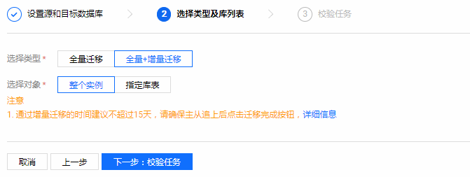

# MangoDB数据迁移

本节我们一起来看一下如何对MangoDB进行数据迁移：

1.登录 数据传输服务控制台，在数据迁移列表，单击【新建任务】创建迁移任务。

2.选择链路地域，链路地域为迁移项目链路目标实例所在地区。说明：MongoDB 数据迁移目前免费。迁移任务订购后不支持更换地域，请谨慎选择。

3.设置源和目标数据库，填写任务设置、源库设置和目标库设置等信息。

4.填写迁移任务的名称，如果您希望迁移任务不是马上执行，可以为迁移任务设置定时执行。

* 任务名称：为任务指定名称。
* 定时执行：为迁移任务指定开始时间。
* **说明**：修改定时任务，校验通过后，需要重新单击【定时启动】，任务才会定时启动。如果任务过了定时启动的时间，定时启动会变为立即启动，单击【立即启动】，会立刻启动任务。

5.填写源库信息，信息填完后，单击【测试连通性】测试是否可以连通您的源库。

6.填写目标库信息，单击【保存】。

7.选择类型和对象，单击【下一步：校验任务】。

8.校验源实例服务是否正常，及目标实例迁入集合是否冲突。

9.校验通过后，返回数据迁移列表，待增量同步完成100%，在操作列单击【完成】，即可完成迁移任务。

