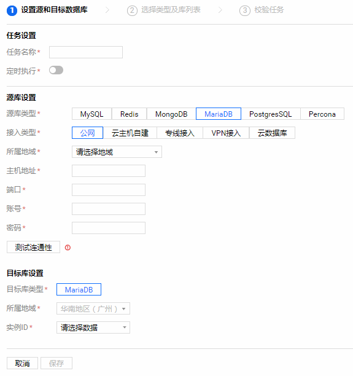
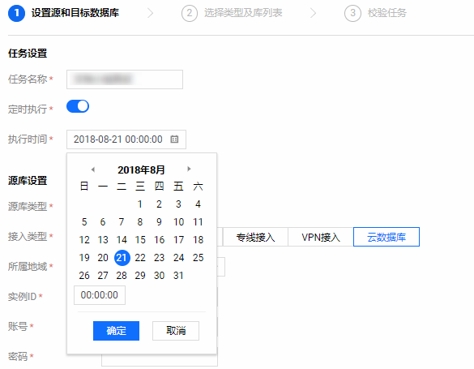
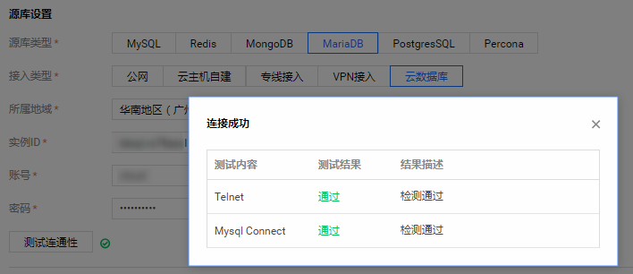
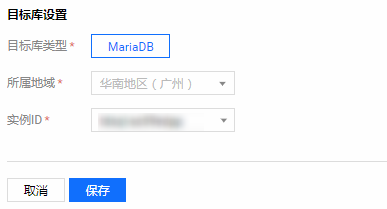
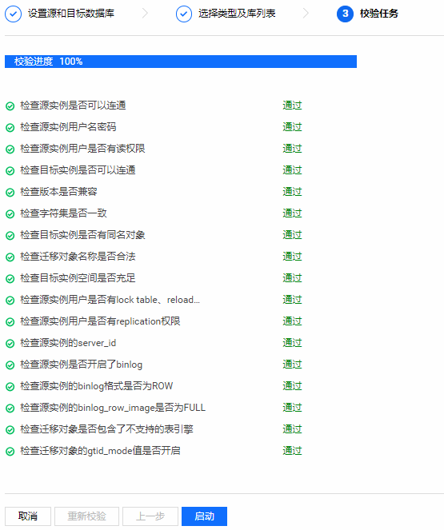
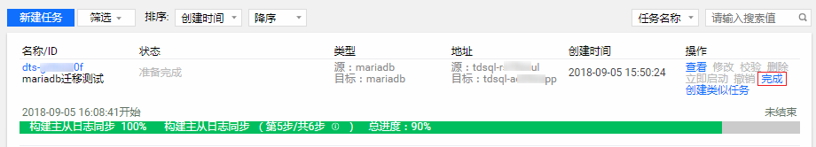
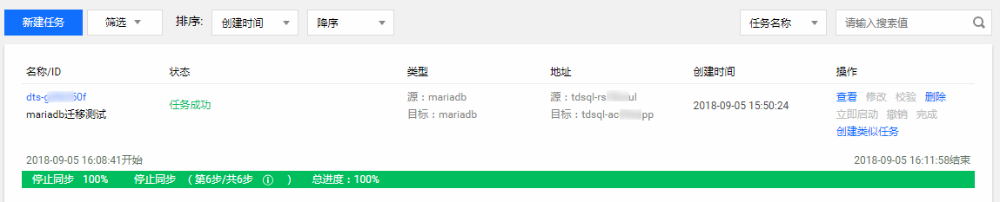

# MariaDB 数据迁移
本节我们看一下MariaDB的迁移流程。

1.**新建迁移任务**

登录腾讯云 DTS 控制台，打开【数据迁移】页面单击【新建任务】。

2.**选择链路区域**

选择您迁移项目链路目标实际所在地区。

**说明**：迁移任务订购后不支持更换地域，请谨慎选择。

3.**设置源库和目标库**

填写任务设置、源库设置和目标库设置等信息。

4.**任务设置**

填写迁移任务的名称，如果您希望迁移任务不是马上执行，可以为迁移任务设置定时执行。

5.**源库设置**

填入源库信息，信息填完后，您可以单击【测试连通性】测试您的源库是否可以连通。

6.**目标库设置**

填写目标库信息，填完后，单击【保存】。

7.**选择类型和库表**

选择类型和库列表，单击【下一步：校验任务】。

8.**校验任务**

校验源实例服务是否正常以及目标实例迁入集合是否冲突。

9.**完成迁移**

校验通过后，返回迁移任务列表，待增量同步完成 90%，单击迁移任务右侧【完成】，方可完成迁移任务。

