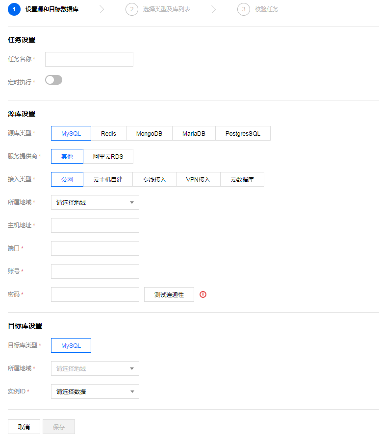
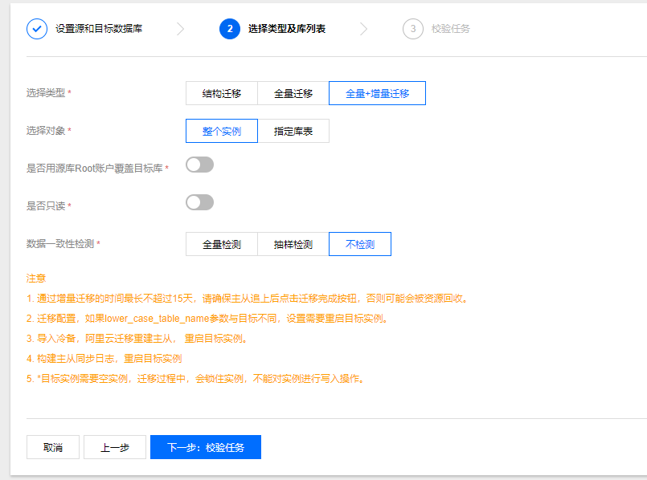

# MySQL数据迁移
数据传输服务 DTS 支持数据迁移功能，提供自建 MySQL 数据库到云数据库 TencentDB 的连续数据复制，用户可在不停服的情况下对数据进行在线热迁移，支持具有公网 IP/Port 或专线接入腾讯云的本地 IDC 或腾讯云 CVM 上 MySQL 数据库迁移。现已支持 MySQL 5.7 数据传输服务。

DTS 数据迁移任务分为冷备数据导出和增量数据同步两步，其中，冷备数据导出以及迁移后的数据对比过程会对源库负载产生一定的影响，建议在业务低峰期或在备库上做数据库迁移。指定库表迁移，如 lower_case_table_name 在迁移校验任务会检查源和目标的此项配置是否一致，不一致报错，会提前避免 lower_case_table_name 引起的重启问题。整实例迁移，迁移配置，如源实例一些必须要重启的参数（如 lower_case_table_name）与目标实例不同，设置需要重启目标实例。导入冷备，阿里云迁移重建主从， 需要重启目标实例。部分场景需要具有源实例的 super 权限。

大部分场景对源实例无 super 权限要求，仅以下场景中需具有源实例的 super 权限。
* 用户在“数据一致性检测”中选择了“全量检测”校验模式。
* 若在 binlog 同步过程中，用户在源实例创建了 Event，且这个 Event 指定了非用于 DTS 数据迁移的账号做 DEFINER，此时不具备 super 权限将会报错

支持迁移的内容有以下几点：
* 支持基础网络、VPC 网络的 CVM 自建 MySQL 数据库迁移至 TencentDB 实例。
* 支持具有公网 IP/Port 的 MySQL 数据库迁移至 TencentDB 实例。
* 支持 VPN 接入、专线接入腾讯云的 MySQL 数据库迁移至 TencentDB 实例。

## 1、迁移前预先检查项

在我们迁移前要有一些预先检查项：

1.检查目标 TencentDB 实例是否有同名库表，避免冲突。

2.检查数据库版本，可支持 MySQL 5.1/5.5/5.6/5.7 版本迁移上云；由于目前腾讯云 TencentDB 已不再支持 MySQL 5.1 版本，因此我们推荐您在迁移前完成 MySQL 5.1 升级到 MySQL 5.5，然后再迁移至 TencentDB for MySQL 5.5。

3.检查目标 TencentDB 实例容量必须大于源实例。

4.在源 MySQL 数据库上创建迁移账号（若有已授权可用于数据迁移的账号，也可不创建）。
```apacheconfig
GRANT ALL PRIVILEGES ON *.* TO "迁移账号"@"%" IDENTIFIED BY "迁移密码";
FLUSH PRIVILEGES;    
```
5.确认源库 MySQL 变量。

6.通过 SHOW GLOBAL VARIABLES LIKE 'XXX';查看 MySQL 全局变量，确认当前状态是否可以进行迁移：
```apacheconfig
server_id > 1      
log_bin = ON;            
binlog_format = ROW/MIXED           
binlog_row_image = FULL            
innodb_stats_on_metadata = 0            
wait_timeout 建议大于或等于3600秒，务必小于7200秒            
interactive_timeout 与wait_timeout设置相同时长            
如果源实例为slave角色，需要在源实例中确认以下参数：           
log_slave_updates = 1           
```

7.修改变量值。

8.修改源库 MySQL 配置文件my.cnf，需重启：
```apacheconfig
log-bin=[自定义binlog文件名]
```

9.b. 动态修改配置：
```apacheconfig
set global server_id = 99;                
set global binlog_format=ROW;              
set global binlog_row_image=FULL;                
set global innodb_stats_on_metadata = 0;
```
## 2、MySQL数据在线导入

1.新建 DTS 数据迁移服务

登录 DTS 控制台，进入【数据迁移】页面，单击【新建任务】。

2.修改配置

填写任务设置、源库设置和目标库设置。如下图：



(1)	**任务设置**
* 任务名称：为任务指定名称。
* 定时执行：可为您的迁移任务指定开始时间。

(2)	**源库设置**

源库类型：目前支持有公网 IP 的 MySQL、云服务器上的自建 MySQL、专线接入腾讯云的 MySQL、VPN 接入的 MySQL 四种源库类型。
<table>
    <tr>
        <th width=200>源库类型</th>
        <th>说明</th>
    </tr>
    <tr>
        <td>有公网 IP 的 MySQL</td>
        <td>能够通过公网 IP 访问的 MySQL 数据库，所需信息：MySQL 主机地址MySQL 端口MySQL 账号MySQL 密码</td>
    </tr>
    <tr>
        <td>云服务器上的自建 MySQL</td>
        <td>支持基础网络和私有网络两种环境下基于 CVM 的自建 MySQL 数据库。使用时需要指定 CVM 的实例 ID 和所处的网络环境。所需信息：所属地域：目前仅支持同地域内的 CVM 自建 MySQL 迁移 TencentDB。若 CVM 与 TencentDB 分处于不同地域，使用 CVM 公网网络，选择【有公网 IP 的 MySQL】项实现迁移CVM 网络：支持基础网络和私有网络私有网络：如选择私有网络，需选择所属的私有网络及子网云服务器实例 IDMySQL 端口MySQL 账号MySQL 密码</td>
    </tr>
    <tr>
        <td>专线接入腾讯云的 MySQL</td>
        <td>本地 IDC 自建 MySQL 使用 专线接入 DC 服务与腾讯云相连接后，可使用DTS数据迁移至腾讯云。所需信息：专线网关：接入腾讯云的数据库服务器所使用的专线网关，了解 专线网关私有网络：专线网关所属的私有网络MySQL主机地址：IDC 内的 MySQL 主机地址，DTS 数据迁移将通过专线网关映射 IP 后访问MySQL 端口MySQL 账号MySQL 密码</td>
    </tr>
    <tr>
        <td>VPN 接入的 MySQL</td>
        <td>本地 IDC 自建 MySQL 通过 腾讯云 VPN 连接服务 或云服务器上自建 VPN 服务接入与腾讯云相连接后，可使用 DTS 数据迁移至腾讯云。所需信息：所属地域：目前仅支持同地域内的 VPN 服务。VPN 类型：云 VPN 服务或云服务器上自建 VPN。VPN 网关：仅云 VPN 服务需要补充 VPN 网关信息，了解 VPN私有网络：VPN 服务所属的私有网络。MySQL 主机地址：IDC 内的 MySQL 主机地址，DTS 数据迁移将通过专线网关映射 IP 后访问MySQL 端口MySQL 账号MySQL 密码</td>
    </tr>
</table>

3.选择所要迁移的数据库

选择要迁移的数据库（可选择全部迁移或部分库表迁移），创建并检查迁移任务信息。

注意：仅在整实例迁移时会迁移 character_set_server、lower_case_table_names 配置项。

若源实例所迁移的库表字符集设置和目标实例字符集设置不一致，则迁移会保留源实例的字符集设置。

* **数据迁移**：将选中数据库中的数据导出，然后在 TencentDB for MySQL 中导入。
* **增量同步**：在进行数据导出导入后，设置 TencentDB for MySQL 为源库的备库，进行主备增量同步。
* **覆盖 root 账号**：因 root 账号将用于云数据库安全效验，若源库 root 账号不存在，会对后续使用 TencentDB 造成不便。因此在整实例迁移时，需指定是否使用源库 root 账号覆盖目标库 root 账号。如需使用源库 root 账号或目标库未设置 root，则选【是】，如需保留目标库的 root 账号，则选【否】。
* **是否只读**：选择只读后，在数据迁移过程中，从源数据库迁移的数据在目标数据库只能读取（Read Only），无法更改，直至用户单击完成迁移任务。




