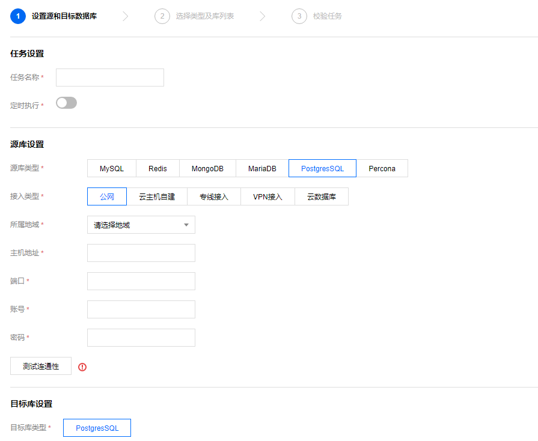
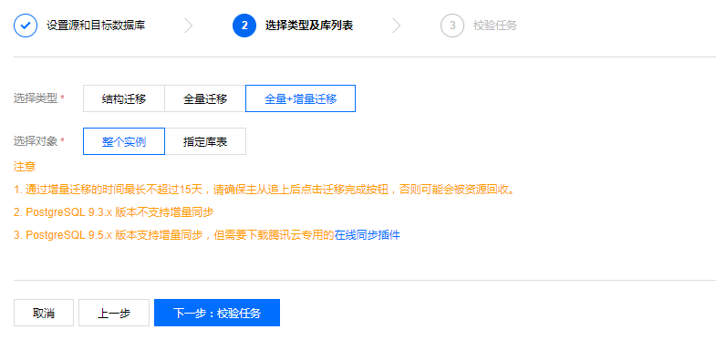
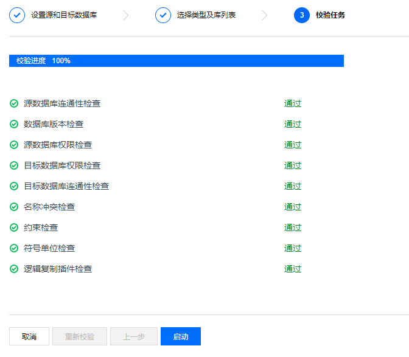

# PostgreSQL 数据迁移

本节我们讲一下如何对PostgreSQL进行数据迁移：

1.**新建 DTS 数据迁移任务**

登录 DTS 控制台，进入数据迁移页，单击【新建任务】。

2.**设置源和目标数据库**

跳转页面后，填写任务设置、源库设置和目标库设置。

3.**任务设置**

* 任务名称：为任务指定名称。
* 定时执行：为迁移任务指定开始时间。

4.**源库设置和目标库设置**

源库类型：目前支持有公网 IP 的 PostgreSQL、云服务器上的自建 PostgreSQL、专线接入腾讯云的 PostgreSQL、VPN 接入的 PostgreSQL、云数据库 PostgreSQL 五种源库类型。

<table>
    <tr>
        <th width=150>源库类型</th>
        <th>说明</th>
    </tr>
    <tr>
        <td>有公网 IP 的 PostgreSQL</td>
        <td>
            能够通过公网 IP 访问的 PostgreSQL 数据库。所需信息：
             PostgreSQL 主机地址
             PostgreSQL 端口
             PostgreSQL 账号
             PostgreSQL 密码
        </td>
    </tr>
    <tr>
        <td>云服务器上的自建 PostgreSQL</td>
        <td>
            支持基础网络和私有网络两种环境下基于云服务器 CVM 的自建 PostgreSQL 数据库。使用时需要指定云服务器 CVM 的实例 ID 和所处的网络环境。所需信息：所属地域：目前仅支持同地域内的 CVM 自建 PostgreSQL 迁移 TencentDB。若 CVM 与 TencentDB 分处于不同地域，使用 CVM 公网网络，选择【有公网 IP 的 PostgreSQL】项实现迁移CVM 网络：支持基础网络和私有网络私有网络：如选择私有网络，需选择所属的私有网络及子网云服务器实例 IDPostgreSQL 端口PostgreSQL 账号PostgreSQL 密码
        </td>
    </tr>
    <tr>
        <td>专线接入的 PostgreSQL</td>
        <td>
            本地 IDC 自建 PostgreSQL 使用 专线接入DC 服务与腾讯云相连接后，可使用 DTS 数据迁移至腾讯云。所需信息：专线网关：接入腾讯云的数据库服务器所使用的专线网关，了解专线网关私有网络：专线网关所属的私有网络PostgreSQL主机地址：IDC 内的 PostgreSQL 主机地址，DTS 数据迁移将通过专线网关映射 IP 后访问PostgreSQL 端口PostgreSQL 账号PostgreSQL 密码
        </td>
    </tr>
    <tr>
        <td>VPN 接入的 PostgreSQL</td>
        <td>
            本地 IDC 自建 PostgreSQL 通过 VPN 连接服务 或云服务器上自建 VPN 服务接入与腾讯云相连接后，可使用 DTS 数据迁移至腾讯云。所需信息：所属地域：目前仅支持同地域内的 VPN 服务VPN 类型：云 VPN 服务 或云服务器上自建 VPNVPN 网关：仅 云 VPN 服务 需要补充 VPN 网关信息，了解 VPN私有网络：VPN 服务所属的私有网络PostgreSQL 主机地址：IDC 内的 PostgreSQL 主机地址，DTS 数据迁移将通过专线网关映射 IP 后访问PostgreSQL 端口PostgreSQL 账号PostgreSQL 密码
        </td>
    </tr>
    <tr>
        <td>云数据库 PostgreSQL</td>
        <td>
            TencentDB for PostgreSQL 云数据库实例。所需信息：
             PostgreSQL 实例 ID
             PostgreSQL 账号
             PostgreSQL 密码
        </td>
    </tr>
</table>

5.**选择要迁移的数据库（可选择全部迁移或部分库表迁移）。**

6.**校验迁移任务**

单击【下一步：校验任务】，对迁移任务信息进行校验，只有所有校验项通过后才能启动迁移任务，校验完成后，单击【启动】即可。

任务校验存在3种状态：
* 通过：表示校验完全通过。
* 警告：表示校验不通过，迁移过程中或迁移后可能影响数据库正常运行但不影响迁移任务的执行。
* 失败：表示校验不通过，无法进行迁移。如果校验失败，请根据出错的校验项，检查并修改迁移任务信息，然后重试校验。

7.**启动迁移**

校验通过后，返回数据迁移列表，在【操作】列，单击【立即启动】开始迁移数据。需要注意的是，如果您设定了迁移任务的定时时间，则迁移任务会在设定的时间开始排队并执行，如果没有设置定时任务，则迁移任务会立即执行。

迁移启动后，您可以在迁移任务下看到对应的迁移进度信息。在鼠标指向步骤后的感叹号提示符时，可显示迁移所需流程和当前所处阶段。

**注意**：由于系统设计限制，一次性提交或排队多个迁移任务将按排队时间串行执行。

8.**增量同步**

创建迁移任务时默认必选增量同步选项，在数据迁移完成后，会将目标 TencentDB for PostgreSQL 库设置成源数据库的备库，通过主备同步来把迁移过程中源库的新增的数据同步到目标 TencentDB for PostgreSQL 库中。此时，源库上的修改都会同步到目标 TencentDB for PostgreSQL 中。

迁移完成后，您必须手动单击【完成】，源库和目标库同步关系会断开，即可完成迁移。

**注意**：在断开同步前，不能往目标数据库实例写入数据，否则可能引起源库和目标库数据不一致而数据比对失败，从而导致迁移失败。

9.**停止迁移**

在迁移过程中，如果您需要停止迁移，可在迁移任务的【操作】列，单击【撤销】停止迁移。

**注意**：再次启动可能导致校验失败或任务失败，您可能需要手动清空目标库内的可能产生冲突的数据库或表，才能再次启动迁移任务。迁移单独的表时，需保证所有表外键依赖的表必须被迁移。

10.**完成迁移**

