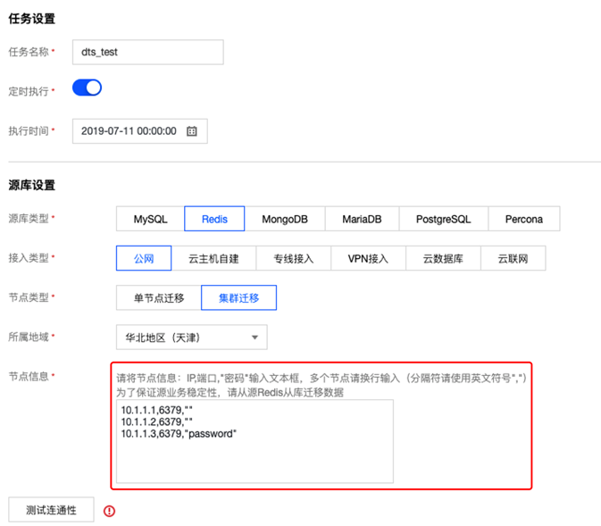
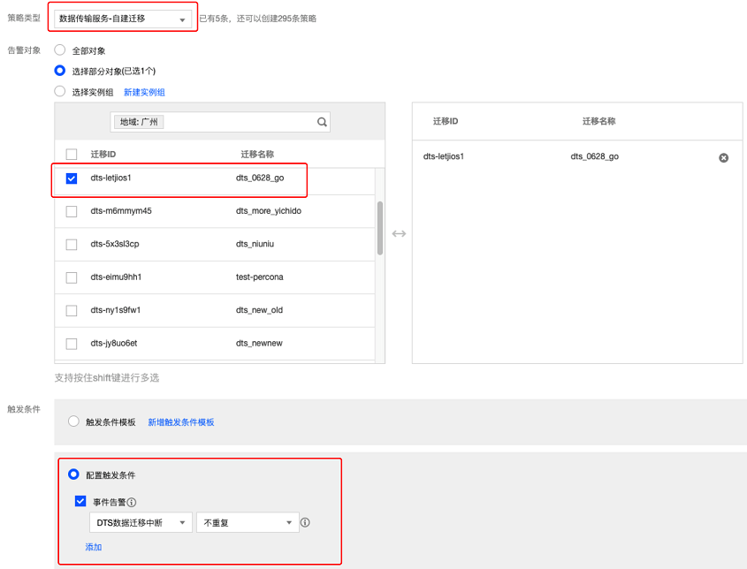

# 数据迁移
腾讯云数据传输服务（Data Transmission Service，DTS）是提供数据迁移、数据同步、数据订阅于一体的数据库数据传输服务。帮助您在业务不停服的前提下轻松完成数据库迁移，利用实时同步通道轻松构建异地容灾的高可用数据库架构，利用数据订阅提供的云数据库实时增量更新数据，用户可根据自身业务需求自由消费增量数据。 DTS for Redis 目前支持各种网络场景、各种版本的 Redis 数据迁移。

<table>
    <tr>
        <th>术语</th>
        <th>说明</th>
    </tr>
    <tr>
        <td>源实例</td>
        <td>迁移的源实例。</td>
    </tr>
    <tr>
        <td>目标实例</td>
        <td>迁移的目标实例，即用户购买的腾讯云数据库 Redis。</td>
    </tr>
    <tr>
        <td>CVM 自建</td>
        <td>用户在腾讯云服务器上部署的 Redis 服务。</td>
    </tr>
    <tr>
        <td>公网自建</td>
        <td>用户在外网环境下部署的 Redis 服务。</td>
    </tr>
</table>

## 1、DTS迁移

首先我们来看一下如何使用DTS迁移：

1.**新建迁移任务**

(1)	登录 数据传输服务控制台 ，在数据迁移列表，单击【新建任务】创建迁移任务。

(2)	在【链路地域】选择对应地域，单击【0元购买】。

2.**设置任务**

(1)	任务名称：为任务指定名称。

(2)	定时执行：为迁移任务指定开始时间。

(3)	说明：修改定时任务，校验通过后，需要重新单击【定时启动】，任务才会定时启动。如果任务过了定时启动的时间，定时启动会变为立即启动，单击【立即启动】，会立刻启动任务。

3.**设置源库和目标库**

以 CVM 上的 Redis 实例为例说明，外网实例迁移下同。
<table>
    <tr>
        <th>字段</th>
        <th>描述</th>
        <th>备注</th>
        <th>必填</th>
    </tr>
    <tr>
        <td>任务名称</td>
        <td>迁移任务的名称</td>
        <td>方便用户管理任务</td>
        <td>是</td>
    </tr>
    <tr>
        <td>CVM 实例 ID</td>
        <td>源 Redis 实例所在的腾讯云服务器 ID</td>
        <td>迁移任务会根据 CVM 实例 ID，检查云服务器运行情况</td>
        <td>是</td>
    </tr>
    <tr>
        <td>CVM 内网 IP</td>
        <td>源 Redis 实例所在的腾讯云服务器的内网 IP</td>
        <td>迁移任务会检查云服务器内网 IP</td>
        <td>是</td>
    </tr>
    <tr>
        <td>端口</td>
        <td>源实例端口号</td>
        <td>迁移任务会访问源实例服务</td>
        <td>是</td>
    </tr>
    <tr>
        <td>密码</td>
        <td>源实例密码</td>
        <td>访问源实例服务时，有 auth 鉴权</td>
        <td>否</td>
    </tr>
    <tr>
        <td>实例 ID</td>
        <td>目标实例 ID</td>
        <td>同步数据到目标实例</td>
        <td>是</td>
    </tr>
</table>
DTS 服务支持 Redis 集群版迁移，不论是 Redis Cluster、Codis 或者是 tewmproxy 架构的集群方案，只需要在 DTS 任务创建的节点信息中，将原集群的所有分片节点地址以及密码填如节点信息即可，强烈建议从源实例的副本节点（从节点）进行数据迁移，避免影响源实例的业务访问。DTS支持无密码迁移，迁移填充信息参考如下。



4.**启动迁移任务**

(1)	网络连通性测试成功，单击【保存】。
(2)	DTS 服务将开始检验迁移任务，满足迁移条件后，即可启动迁移任务。
(3)	启动任务后，任务状态变为【校验中】，任务会再做一次参数校验，校验期间只能取消任务、查看任务和查看校验情况。
(4)	参数校验成功后，数据开始迁移。
(5)	数据同步阶段，会展示数据偏移量、源实例、目标实例 key 变化情况。

5.**设置迁移告警**

DTS 服务支持迁移中断告警，以便及时了解到迁移任务的异常，迁移告警配置流程如下：

1) 登录 云监控控制台，在左侧导航选择【告警配置】>【告警策略】页面。
2) 单击【新增】新建策略，进行告警策略配置。
3) 策略类型：选择【数据传输服务】>【自建迁移】。
4) 告警对象：选择需要监控的 DTS 任务，配置【触发条件】和【告警对象】完成告警配置。



6.**完成迁移任务**

断开同步前，可在目标实例上验证数据，如果验证无误，即可完成迁移任务。
当源实例和目标实例的 key 同步一致时，单击【完成】确定，即可完成数据同步操作。

redis-port 是一组开源工具集合，主要用于 Redis 节点间的数据库同步、数据导入、数据导出，支持 Redis 的跨版本数据迁移，工具集中包括以下工具：

* redis-sync：支持在 Redis 实例之间进行数据迁移。
* redis-resotre：支持将 Redis 的备份文件（RDB）导入到指定 Redis 实例。
* redis-dump：支持将 Redis 的数据备份为 RDB 格式文件。
* redis-decode：支持将 Redis 备份文件（RDB）解析为可读的文件。

## 2、 redis-port迁移

同样我们也可以使用redis-port对数据库进行迁移，具体迁移过程如下。

### 2.1、使用 redis-sync 在线迁移

1.**redis-sync 工具迁移原理**

(1)	工具分为两大模块，模拟成复制节点从源实例同步数据，以及将复制的数据翻译成写入命令更新到目标实例。

(2)	复制数据分为两个阶段，全量同步阶段和增量同步阶段。

2.**参数说明：**

```apacheconfig
-n：并发写入的任务数量，建议不设置或者设置为 CPU 核心数量 * 2。
-m：源实例地址，格式为"password"@ip:port，免密码认证下格式为ip:port。
-t：目标实例地址，格式为"password"@ip:port，免密码认证下格式为ip:port。
--tmpfile=FILE：临时文件名称。
--tmpfile-size=SIZW：临时文件最大长度。
--help：查看帮助命令。
```

示例：
```apacheconfig
./redis-sync -m 127.0.0.1:6379 -t "xxx2018"@10.0.5.8:6379
```
4.**输出日志：**
```apacheconfig
[root@VM_5_16_centos bin]# ./redis-sync -m 127.0.0.1:6379 -t "xxx2018"@10.0.5.8:63792019/02/21 09:56:00 sync.go:76: [INFO] sync: master = "127.0.0.1:6379", target = "xxx2018@10.0.5.8:6379"2019/02/21 09:56:01 sync.go:103: [INFO] +2019/02/21 09:56:01 sync.go:109: [INFO] sync: runid = "f63e2ad58e2fcc15c8cc122f15778389a012c1a4", offset = 185762712019/02/21 09:56:01 sync.go:110: [INFO] sync: rdb file = 9063349 (8.64mb)2019/02/21 09:56:01 sync.go:208: [INFO] sync: (r/f,s/f,s) = (read,rdb.forward,rdb.skip/rdb.forward,rdb.skip)
2019/02/21 09:56:02 sync.go:250: [INFO] sync: rdb = 9063349 - [100.00%] (r/f,s/f,s)=(1703936/71754,0/0,0) ~ (1.62mb/-,-/-,-) ~ speed=(1.62mb/71754,0/0,0)2019/02/21 09:56:03 sync.go:250: [INFO] sync: rdb = 9063349 - [100.00%] (r/f,s/f,s)=(3407872/153850,0/0,0) ~ (3.25mb/-,-/-,-) ~ speed=(1.62mb/82096,0/0,0)2019/02/21 09:57:54 sync.go:250: [INFO] sync: rdb = 9063349 - [100.00%] (r/f,s/f,s)=(80487526/411969,0/1587212,0) ~  (76.76mb/-,-/-,-) ~ speed=(0/0,0/0,0)
```
5.**使用说明：**

(1)	目标实例的 db 数据要求大于源实例的 db 数量，否则迁移将失败。

(2)	如果迁移中途因为网络中断或者其他原因断开，需要先清空目标实例然后再次执行迁移，否则可能出现脏数据。

(3)	迁移的进度，日志显示 "sync: rdb = 9063349 - [100.00%]" 该内容表示全量数据已经完成同步，正在进行增量数据同步，"speed=(0/0,0/0,0)" 表示增量数据已经完成同步。

(4)	停止迁移，通过 Ctrl+C 命令或者其他方式终止工具的执行，即可停止数据同步。


