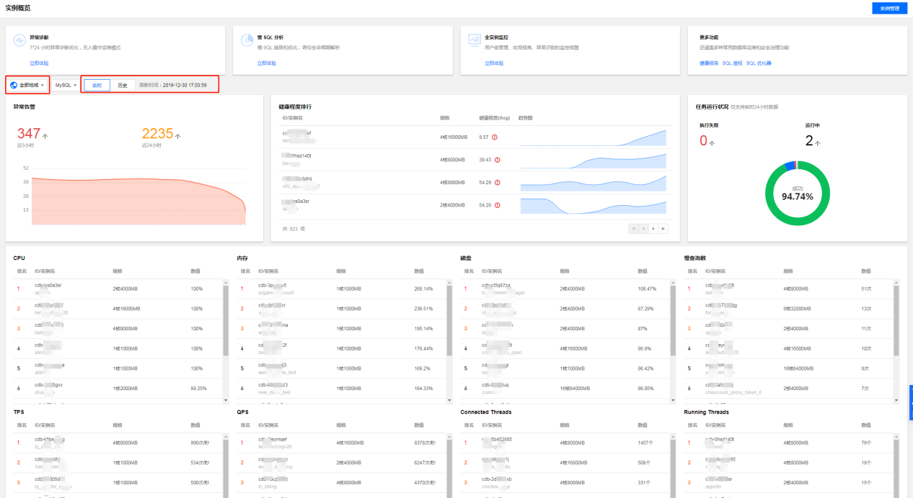

# DBbrain产品功能

## 1、实例概览

实例概览页展示了用户实例全局的大盘，可以查看所有接入实例的任务执行、地域分布、实时性能以及健康评估等情况。

登录 DBbrain 控制台，在左侧导航选择【实例概览】页。

1.**推荐功能**

顶部导航栏提供了DBbrain官方推荐的热门功能入口，点击“立即体验”，快速跳转至对应功能详情页。

2.**异常告警**

DBbrian的7*24小时异常诊断模块会实时发现数据库实例存在的问题以及提供相应的优化方案，在改模块中会显示出近3小时和近24小时的异常告警总数量，点击可跳转至“异常汇总”页面查看详情。

3.**健康排行榜**

DBbrian 会定期为用户的所有实例进行健康巡检打分，通过该页面用户可以看到所有实例的健康得分情况（当前值和历史趋势），单击对应实例可查看“健康报告”的详情。

4.**任务运行状况**

任务运行状况中展示了目前实例存在任务的执行情况详情。

5.**监控情况排行**

资源监控排行展示了所选监控指标的消耗情况 TOP 排行，包括 CPU、内存、磁盘、慢查询数、TPS、QPS、Connected Threads以及Running Threads。用户可单击对应实例查看异常诊断详情。

## 2、实例管理

DBbrain实例管理页提供了“实例列表”和“异常告警”两个页面功能。

1.**实例列表**

实例列表页展示了目前左右支持DBbrian的数据库实例信息，展示的信息包括数据库实例基本信息（实例名/ID、状态、实例类型	、地域、配置、数据库类型、内网地址）、接入来源、分组、异常告警、健康程度以及操作。
* 【异常告警】数显示的是由“7*24小时异常诊断”中所发现的该实例异常项的数量，可点击查看详情。
* 【健康程度】是通过定时健康巡检所得出的实例健康程度得分（分数越高代表健康程度越高）；
* 【操作】中点击“一键诊断”和“性能查看”的具体功能，可跳转至具体功能详情页查看实例运营状态；

* 【分组】选中（单个或批量）实例，点击“管理分组”可为所选实例添加对应的分组名，分组可选择默认分组或自定义新的分组。

2.**异常告警**

异常告警页展示了用户账号下支持DBbrain接入的数据库实例产生的异常告警（由“7*24小时异常诊断”中所发现的异常项）信息的汇总。严重等级包括提示、告警、严重、致命，危险程度依次递增。用户可进行按字段筛选、聚合和搜索。点击“详情”可查看异常的具体信息和优化建议。

## 3、全实例监控
全实例监控页为用户提供全实例维度（用户整体视角）的数据库监控指标展示。统一监控视图里展示所有实例单个监控指标的横向视图，便于用户查看和发现数据库异常问题，也为用户提供全新的宏观监控查看视角。

登录 DBbrain 控制台，在左侧导航选择【全实例监控】页。

1.**地域切换**

全实例监控页面默认展示全地域的数据库实例，可通过上方的下拉菜单按地域进行筛选。

2.**监控指标切换**

可通过上方的下拉菜单搜索控件，选择需要查看的监控指标，支持 MySQL 云监控提供的所有监控指标。

3.**实时/历史**

全实例监控页面支持查看实时监控和历史监控，历史监控中会显示所选时间段内该指标的 MAX 值和出现的时间点。

4.**实例搜索**

支持按实例名和内网 IP 进行模糊搜索。

5.**宫格切换**

支持9宫格和36宫格的视图切换，用户实例较多的情况下建议使用【36宫格】视图，全局视角更明显。

单击实例右上角的展开按钮，可以查看清晰的实例信息和指标趋势详情。

## 4、异常诊断

异常诊断功能为用户的数据库实例提供实时的性能监控、健康巡检、故障诊断和优化，让用户既可以直观地感知数据库实例实时的运行状况，也可以定位实时出现的性能异常，并根据优化建议进行系统优化。异常诊断提供实时和历史两种查看方式。

登录 DBbrain 控制台，在左侧导航选择【异常诊断】页。

### 4.1、实时/历史监控

在异常诊断页主要展示 CPU 利用率、内存使用率、磁盘使用率、输入/输出流量的信息，其中，磁盘使用率详情可单击右上角的【详情】查看。

### 4.2、实时/历史诊断

* 【实时/历史诊断】栏展示实例实时的 Running Threads 数、CPU 使用率以及诊断事件。
* 【诊断提示】栏展示诊断事件历史记录的概要信息，包括等级（分为健康、提示、告警、严重、致命）、开始时间、诊断项、持续时长。DBbrain 会定期（每10分钟）的对实例进行健康巡检。
1. 单击【查看详情】或【诊断提示】的记录项可进入诊断详情页。

2. 鼠标选择对应时间段，可拉伸该时间段的诊断视图，查看更细粒度的视图详情。拉伸视图后单击右上角的【重置】可恢复视图。

3. 在视图单击图表曲线可查看某时刻的监控数据，涵盖资源、性能、引擎三大维度，近20项核心监控指标，单击【实例监控】可跳转至实例控制台的监控页面，查看指标详情趋势。

4. 在视图单击诊断事件，在下方会显示该事件的详情。
* 事件概要：包括诊断项、起止时间、风险等级、持续时长、概要等信息。
* 现象描述：异常事件（或健康巡检事件）的外在表现现象的快照和性能趋势。
* 智能分析：分析导致性能异常的根本原因，定位具体操作。
* 专家建议：提供优化指导建议，包括但不限于 SQL 优化（索引建议、重写建议）、资源配置优化和参数调优。

