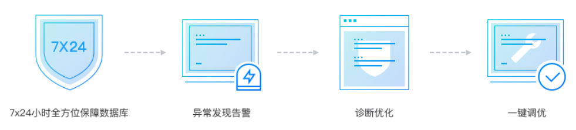
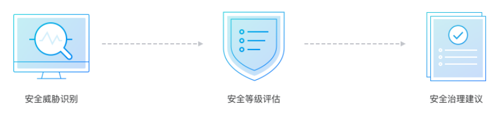
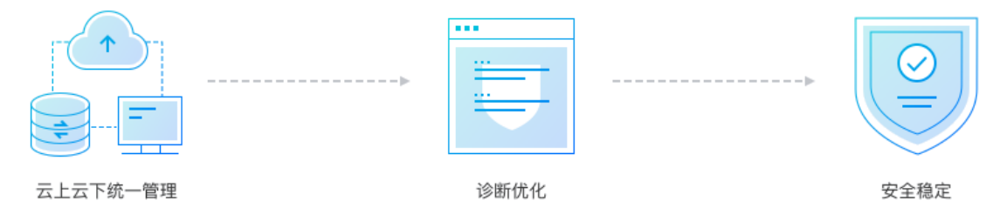
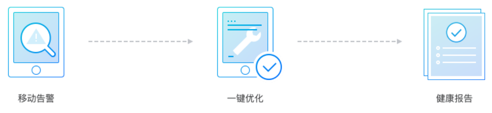

# 数据智能管家DBbrain

## 1、DBbrain产品概述

数据库智能管家 DBbrain 是一款数据库智能诊断和优化产品。为用户提供实时的数据库防护，在出现故障时高效的帮助用户定位原因并提供解决方案，同时也协助用户进行源头的预防。DBbrain 将大量数据库问题的诊断优化工作自动化，利用机器学习、大数据手段快速复制资深DBA的成熟经验，服务于云上和云下企业。

## 2、DBbrain产品优势

1.实时诊断优化

提供7 * 24小时实时数据库异常诊断，根据实时信息进行分析处理，增强异常发现、处理的及时性，开创定期巡检、主动异常发现、秒级分析优化的数据库健康守护新模式。

2.安全高效

无入侵设计，对数据库环境无侵入，避免对在线业务产生影响。收集的信息采用加密存储和加密压缩传输，保证数据安全。

3.优化效果可预见

数据收集、异常分析、诊断优化方面具备超高精准性，不仅提供异常诊断的理论依据，同时提供模拟优化后的结果进行性能对比，协助用户更加精准的把握优化效果。

4.多场景兼容

支持多款 SQL、NoSQL、NewSQL 数据库类型，应用于云上、云下数据库场景，不仅为腾讯云数据库实例提供诊断分析服务，也支持用户自建的数据库和其他云部署的数据库实例，助力用户打造数据库混合云管理的场景。

5.掌上一键管理

借助微信小程序生态，拓展了用户在移动端的使用体验，让用户随时随地都能掌握数据库运行状况，并能一键管理和优化数据库。

6.AI 助力

DBbrain 是云数据库智能化转型的突破口，依托腾讯云专业的深度学习算法模型和海量样本训练环境，为用户提供在线自动优化数据库性能的服务，以及更为精准的威胁分析和安全治理建议服务。

7.实例大盘

实例大盘为用户提供了一个整体把握数据库整体运行状况的实时大屏，也是 DBbrian 的入口页面和总览页面，支持云上、云下数据库实例接入，可支持多终端展示，帮助用户更好的掌握所有数据库实例的动态，及时掌握数据库实例健康情况和异常状况监控。

## 3、DBbrain应用场景

1.数据库日常运维场景

DBbrain 为用户提供7 * 24小时数据库异常发现、诊断分析服务，并通过智能化告警服务及时触达用户。同时提供专家建议和一键优化功能，利用 AI 技术为用户提供在线自动优化数据库性能的服务，针对业务访问特性定制化生成最优配置，大幅提高数据库运维效率。

 
2.安全威胁识别场景

DBbrain 依托腾讯云专业的深度学习算法模型和海量样本训练环境，可应对变化多端的攻击场景，对各类变体攻击以及非常见威胁操作实现监控和告警。结合数据资产信息、敏感数据信息，对严重偏离模型的用户、行为、数据进行告警和安全等级评估，帮助管理员发现恶意操作等问题，为用户数据库提供更为精准的威胁分析和安全治理建议。

 
3.混合云管理数据库场景

DBbrain 适用于云上、云下数据库场景，不仅为腾讯云数据库实例提供诊断优化服务，也支持用户自建的数据库和其他云部署的数据库实例，采用无入侵设计、安全的数据链路，确保数据安全，助力用户打造数据库混合云管理的统一平台。

 
4.掌上数据库运维场景

DBbrain 支持 PC 端、移动端的多终端模式，借助微信小程序生态的移动端模式，让用户可在移动端体验移动告警、健康日报订阅、异常诊断以及一键优化等功能。

